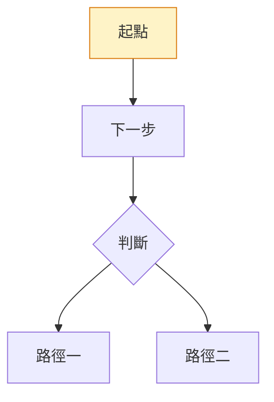

# 開發規範

## 新增課程：完整步驟

### Step 1：建立 Markdown 檔案

在對應分類目錄建立 `.md` 檔案，命名使用英文小寫 kebab-case：

```
docs/ai-fluency/new-course-name.md
docs/claude-products/new-product.md
docs/developer/new-dev-course.md
```

### Step 2：更新 config.mts sidebar

開啟 `docs/.vitepress/config.mts`，在對應分類的 sidebar 陣列加入新項目：

```ts
// 範例：加入 AI 素養新課程
'/ai-fluency/': [
  {
    text: '🧠 AI 素養課程',
    items: [
      // ... 現有項目 ...
      { text: '新課程名稱', link: '/ai-fluency/new-course-name' },
      //                          ↑ 不含 .md 副檔名
    ],
  },
],
```

### Step 3：更新 docs/index.md 課程總覽表格

`docs/index.md` 底部有「全部 17 門課程一覽」表格，需同步新增一列：

```markdown
| [新課程名稱](/ai-fluency/new-course-name) | AI 素養 | ⭐ 初學者 | 無 |
```

### Step 4：更新 dev-docs/FEATURES.md

在對應分類的課程列表中新增課程資訊。

---

## 命名規則

| 類型 | 規則 | 範例 |
|------|------|------|
| 檔案名稱（URL slug） | 英文小寫 kebab-case | `framework-foundations.md` |
| 分類目錄 | 英文小寫 kebab-case | `ai-fluency/`, `claude-products/` |
| 頁面標題（H1） | 繁體中文 | `# AI 素養：框架與基礎` |
| sidebar text | 繁體中文（可含 emoji） | `AI 素養：框架與基礎` |

## 課程頁面建議結構

```markdown
# 課程名稱

> 一句話描述課程核心價值

## 課程概覽

- **難度**：⭐ 初學者 / ⭐⭐ 中級 / ⭐⭐⭐ 高級
- **前置條件**：XXX
- **預計時間**：X 小時

## 學習目標

## 核心概念

## 重點摘要

## 相關資源
```

## 難度標示規範

| 符號 | 說明 | 對應課程類型 |
|------|------|------------|
| ⭐ 初學者 | 無技術背景要求 | AI 素養、Claude 101 |
| ⭐⭐ 中級 | 需要基礎技術知識 | Claude Code、MCP 入門 |
| ⭐⭐⭐ 高級 | 需要扎實技術背景 | MCP 進階、Claude API |

## Mermaid 圖表使用方式

在 Markdown 中直接使用，不需額外設定：

````markdown

````

參考 `docs/roadmap.md` 的 4 個流程圖範例。

## 環境變數

本專案為純靜態文件網站，**不使用任何環境變數**。所有設定均在 `config.mts` 中硬編碼。

## 計畫歸檔流程

1. **命名格式**：`dev-docs/plans/YYYY-MM-DD-<feature-name>.md`
2. **文件結構**：User Story → Spec → Tasks
3. **功能完成後**：移至 `dev-docs/plans/archive/`
4. 同步更新 `dev-docs/FEATURES.md` 和 `dev-docs/CHANGELOG.md`

## 版控注意事項

- `docs/.vitepress/dist/` 已在 `.gitignore` 中（建置產物不納入版控）
- `node_modules/` 已在 `.gitignore` 中
- commit message 格式：`type: 描述`（如 `docs: 新增 MCP 進階課程頁面`）
