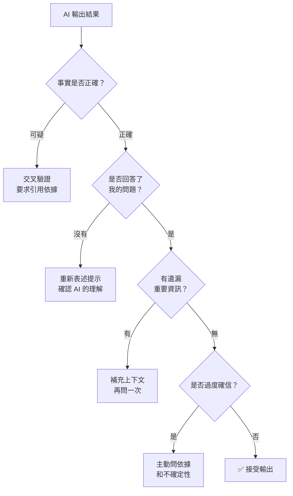
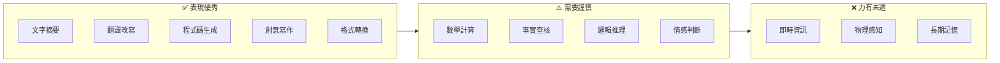

# ⚡ AI 能力與限制

<Badge type="tip" text="⭐ 初學者" /> <Badge type="info" text="短課程" /> <Badge type="warning" text="完成可獲證書" />

> **原始課程**：[AI Capabilities and Limitations](https://anthropic.skilljar.com/ai-capabilities-and-limitations)（英文）

## 📖 課程簡介

這門課是 [AI 素養框架](/ai-fluency/framework-foundations) 的**最佳搭配課程**。框架課教你「如何與 AI 協作的人類技能（4Ds）」，而本課程則深入教你「AI 機器本身的運作方式」——了解它的能力邊界、常見失敗模式，以及如何診斷和修正。

了解 AI 的能力邊界，你就能設定正確的期望值：不會因為 AI 的失敗而措手不及，也不會錯過它能發揮最大效益的機會。這是 **4D 框架中「委派」和「辨識」兩個能力的知識基礎**。

## ⚠️ 前置條件

::: info 前置條件
**無需前置知識。** 建議搭配 [AI 素養：框架與基礎](/ai-fluency/framework-foundations) 一起學習，效果最佳。
:::

## 🎯 學習目標

完成本課程後，你將能夠：

- 建立現代生成式 AI 系統的**工作心智模型**（無需技術背景）
- **識別**六種常見的意外輸出類型
- **判斷**任務在能力—限制光譜上的大致位置
- 根據輸出類型**套用針對性的修正方法**
- 更有效地實踐 4D 框架中的**委派**與**辨識**能力

## 📋 課程大綱

### 🤖 單元一：生成式 AI 如何運作

不需要數學或程式背景的直觀解釋：

- 語言模型的本質：從「預測下一個詞」到複雜對話

  <details>
  <summary>詳細說明</summary>

  語言模型的核心運作方式是「根據前面的文字，預測最可能出現的下一個詞」——不斷重複這個過程就能生成完整的段落。但經過大規模訓練後，這個簡單的機制產生了「湧現能力」：模型學會了推理、摘要、翻譯、寫程式等複雜任務。理解這一點很重要——AI 不是「理解」語言，而是**極其擅長模式匹配**，這解釋了它為什麼既能產出驚人的回答，又偶爾犯下離譜的錯誤。

  </details>

- 訓練資料如何塑造模型的「知識」與「偏好」

  <details>
  <summary>詳細說明</summary>

  模型的所有知識來自訓練資料——大量的書籍、網頁、文章等文本。這意味著：**訓練資料中出現頻率高的知識，模型回答得更準確**（如英文內容多於中文，主流觀點多於小眾觀點）。同樣地，訓練資料中的偏見也會被模型吸收。了解這一點有助於你預判 AI 在什麼主題上可能較弱或有偏差——冷門領域、特定文化脈絡、非英語內容，都需要額外留意。

  </details>

- 為什麼模型有知識截止日，以及這代表什麼

  <details>
  <summary>詳細說明</summary>

  模型的訓練資料有時間範圍——在截止日之後發生的事件、發表的論文、更新的法規，模型**完全不知道**。重要的是：模型不會說「我不知道這件事，因為它發生在我的訓練之後」——它更可能用舊資訊回答，或生成聽起來合理但實際過時的內容。當你的問題涉及近期事件或最新資訊時，必須自行提供背景或使用 Research Mode 等工具補充。

  </details>

- Token、上下文視窗的直觀概念

  <details>
  <summary>詳細說明</summary>

  **Token** 是 AI 處理文字的基本單位，大約等於一個英文單詞或 1-2 個中文字。**上下文視窗**是 AI 一次能「看到」的 Token 總量——包括你的提示、AI 的回應、上傳的文件等。一旦超過這個限制，最早的內容會被「遺忘」。直觀理解：上下文視窗就像 AI 的「工作記憶」，越大就能處理越長的文件，但它有上限，不是無限的。

  </details>

::: tip 為什麼要了解這些？
了解 AI 的運作原理，就能預測它在什麼情況下會失敗，以及為什麼失敗。這讓你的「辨識」能力更有依據，而不只是憑感覺懷疑輸出。
:::

### 📊 單元二：AI 的能力光譜

AI 不是萬能的，也不是處處不行的——能力因任務類型而異：

**AI 表現優秀的任務：**
- 文字摘要、翻譯、改寫
- 程式碼生成與說明
- 創意發想與腦力激盪
- 結構化資訊整理與格式轉換
- 解釋概念、類比說明

<details>
<summary>為什麼這些任務表現優秀？</summary>

這些任務的共同特徵是**不需要「正確答案」，而是需要「合理的語言輸出」**。摘要、改寫、翻譯的品質可以用語言模型的核心能力（理解文字結構和語義關係）直接解決。創意發想則是模型「知道很多不同的東西」這個特性的最佳發揮——它能從龐大的訓練資料中組合出你可能沒想到的連結。格式轉換和概念解釋同樣是純語言操作，模型見過大量範例，表現自然出色。

</details>

**AI 需要謹慎的任務：**
- 複雜數學計算（需驗證）
- 需要引用具體來源的事實陳述
- 涉及近期事件的問答
- 需要個人情感判斷的場景

<details>
<summary>為什麼這些任務需要謹慎？</summary>

這些任務要求的**不只是語言能力，還涉及精確性或即時性**。
數學計算中，語言模型容易在多步驟運算中累積錯誤；  
事實引用容易出現「幻覺」——生成看似真實但不存在的來源；  
近期事件受限於知識截止日；  
情感判斷需要模型不具備的人類經驗和同理能力。
這些任務不是完全不能用 AI，但必須搭配人類驗證或額外工具。

</details>

**AI 明顯力有未逮的任務：**
- 取得即時資訊（超出訓練截止日）
- 物理感知與環境感知
- 長期跨對話記憶（除非有特定工具支援）
- 需要個人關係背景的互動

<details>
<summary>為什麼這些任務力有未逮？</summary>

這些是語言模型的**結構性限制**，不是訓練不夠，而是架構上不支援。
AI 沒有感官，無法感知物理環境；  
沒有持久記憶，每次對話都是「空白起點」（除非透過 Projects 等工具刻意延續脈絡）；  
沒有個人經歷，無法真正理解人際關係的微妙之處。
了解這些根本限制，能幫助你避免在這些領域對 AI 抱有不切實際的期待。

</details>

### ⚠️ 單元三：六種常見失敗模式

| 失敗類型 | 症狀 | 常見原因 | 修正方法 |
|---------|------|---------|---------|
| **幻覺（Hallucination）** | 回應聽起來合理但事實錯誤 | 訓練資料不足或模型過度自信 | 要求引用來源；交叉驗證重要事實 |
| **過度確信** | 對不確定事物表現得非常肯定 | 語言模型傾向流暢表達 | 主動問「你有多確定？」；要求說明依據 |
| **過度概括** | 給出過於寬泛或籠統的答案 | 提示不夠具體 | 提供更多上下文和限制條件 |
| **語境誤解** | 回答的不是你真正的問題 | 提示不夠清晰 | 重新表述；先確認 AI 的理解是否正確 |
| **資訊截止** | 不知道近期事件或更新 | 知識訓練截止日的限制 | 自行提供最新資訊；說明背景脈絡 |
| **偏見（Bias）** | 不平衡或帶有傾向的回應 | 訓練資料中的既有偏見 | 明確要求多角度分析；提供對比觀點 |

### 🔧 單元四：診斷與修正策略

掌握失敗模式後，下一步是快速診斷與修正：

**診斷流程：**



**針對不同失敗類型的修正提示範例：**

幻覺或過度確信：
```
請列出你用來回答這個問題的具體依據。
如果你不確定，請直接說「我不確定」。
```

語境誤解：
```
在你回答之前，請先用一句話說明你理解我的問題是什麼。
```

資訊截止：
```
背景說明：[在此提供最新資訊]
基於以上最新背景，請回答以下問題：[你的問題]
```

## 📝 重點筆記

### 🎯 設定正確的 AI 期望

> **不要把 AI 當成「全知者」或「搜尋引擎」。它更像是一位博學但偶爾會說錯話的聰明同事。**

- 它知道很多，但不是全部
- 它很有信心，但信心程度不等於準確性
- 它很快，但速度不代表準確
- 它會努力回應，但「努力」不代表「正確」

### ⚖️ 能力—限制光譜視覺化



### 🔗 與 4D 框架的連結

理解 AI 能力與限制，直接強化兩個 D：

- **委派（Delegation）**：知道能力邊界，才能做出明智的「該不該交給 AI」決策
- **辨識（Discernment）**：了解失敗模式，才能有依據地評估輸出品質

## 💡 學習建議

**實作練習：**

1. **探索幻覺**：故意問 Claude 一個你已知正確答案的冷門事實問題，觀察它是否正確、以及它的「確信程度」。

2. **測試資訊截止**：詢問 Claude 一個最近 6 個月發生的重要事件，觀察它如何回應自己的資訊限制。

3. **診斷練習**：對同一個任務，先不給任何背景資訊，觀察輸出；然後加入豐富的上下文再問一次，比較兩次輸出的差異，找出具體改善在哪裡。

4. **失敗分類**：在一週內，每當你覺得 AI 的回應「不對勁」，試著用本課的分類表找出是哪種失敗類型，再套用對應的修正方法。

**搭配學習：**
- 先完成 [AI 素養：框架與基礎](/ai-fluency/framework-foundations)
- 之後繼續特定族群課程（教育者 / 學生）

## 🔗 相關課程

- [AI 素養：框架與基礎](/ai-fluency/framework-foundations)（建立 4D 協作框架）
- [Claude 101](/claude-products/claude-101)（實際操作體驗 Claude）

## 🎯 互動練習

準備好測試你的理解了嗎？前往 [AI 能力與限制互動練習](/ai-fluency/capabilities-practice)，透過失敗模式辨識、提示改寫等題目鞏固本課程的核心概念。

## 📚 延伸閱讀

- [Anthropic 學習資源](https://www.anthropic.com/learn)（英文，官方課程列表）
- [AI Fluency Framework 官方網站](https://aifluencyframework.org/)（英文，完整框架說明）
