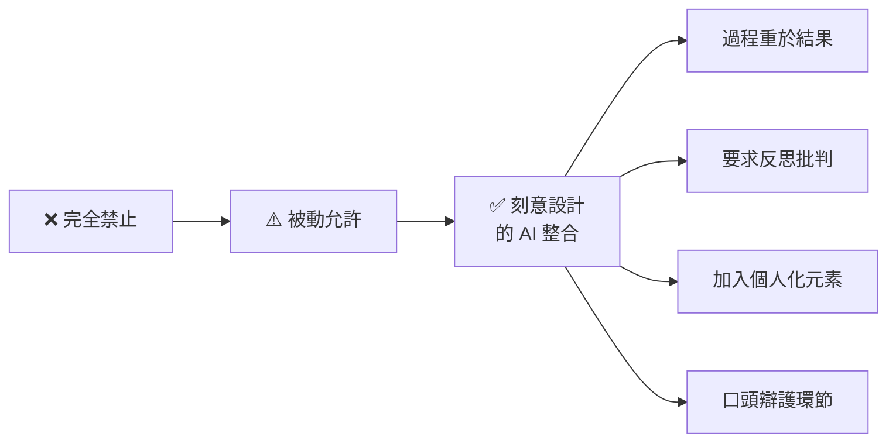
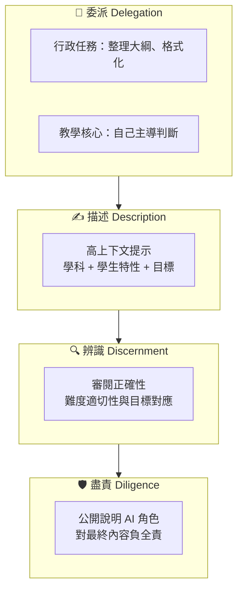

# 👩‍🏫 教育者的 AI 素養

<Badge type="tip" text="⭐ 初學者" /> <Badge type="info" text="約 3 小時 · 4 課" /> <Badge type="warning" text="完成可獲證書" />

> **原始課程**：[AI Fluency for Educators](https://anthropic.skilljar.com/ai-fluency-for-educators)（英文）

## 📖 課程簡介

本課程專為**教師、教學設計師和教育領導者**設計，由 Anthropic 與學術專家 Prof. Joseph Feller（UCC）和 Prof. Rick Dakan（Ringling College）合作開發。

課程包含 **4 堂課**、約 35 分鐘影片，並附有深度練習，總學習時間約 3 小時。

課程的核心是：**先幫助你自己建立 AI 素養，再引導你把這套素養帶入教學現場**。你將學習如何以 4D 框架重新思考課程設計、評量策略，以及如何將 AI 作為思考夥伴協助你的教學工作——而不是用 AI 取代教育的核心價值。

::: info 與「教授 AI 素養」的差異
本課程（AI Fluency for Educators）聚焦在**教育者自己的 AI 素養應用**（課程設計、評量、教學實踐）；[教授 AI 素養](/ai-fluency/teaching) 則聚焦在**如何訓練他人**（企業培訓師、L&D 人員）提升 AI 素養。
:::

## ⚠️ 前置條件

::: info 前置條件
**無必要前置條件。** 但強烈建議先完成 [AI 素養：框架與基礎](/ai-fluency/framework-foundations)，以理解 4D 框架，本課程許多內容建立在 4Ds 基礎上。
:::

## 🎯 學習目標

完成本課程後，你將能夠：

- 複習並深化 **4D 框架**在教育情境中的應用
- 以 4Ds 視角設計**富含上下文的 AI 輔助工作流程**
- 將 AI 作為思考夥伴，協助**課程與教材設計**
- 設計考量 AI 工具的**真實評量（Authentic Assessment）**
- 以身作則，在教學中**示範負責任的 AI 協作**

## 📋 課程大綱（4 堂課）

### 第 01 課：4D 框架的教育者視角（複習與深化）

回顧 4D 框架（委派、描述、辨識、盡責），但這一次從教育者的角度重新詮釋：

- 哪些教學工作適合委派給 AI？哪些必須保留人類主導？

  

  
詳細說明

  適合委派的教學工作通常是**重複性高、格式化強、不涉及教學判斷**的任務：出題格式調整、教材格式轉換、行政通知草稿等。必須保留人類主導的則包括：課程核心設計（學習目標如何對應學生需求）、對個別學生的評估與回饋（需要了解學生的個人脈絡）、以及任何涉及教學價值觀選擇的決策。關鍵原則：**AI 可以幫你「做事」，但不該幫你「做判斷」。**

  

- 在教育場景中，「辨識」AI 輸出特別重要——你的示範直接影響學生——如果你在教材中使用了未經審核的 AI 輸出，學生可能會認為這是「正確」的示範，進而降低自己對 AI 輸出的審視標準。

- 教育者的「盡責」：如何建立課堂 AI 使用的透明度文化——從自己做起：在課堂上公開說明你使用了 AI 協助備課，並展示你如何審核和修正 AI 的輸出，讓學生看到「負責任使用 AI」的具體行為模式。

這堂課也帶你思考：AI 如何改變學習與教育的本質，以及這對你的角色意味著什麼。

### 第 02 課：以 4Ds 建立富含上下文的工作流程

把 4Ds 落地為教育者的實際工作流程：

- **高上下文提示設計**：如何為教育任務撰寫包含學習目標、學生背景、課程脈絡的精準提示

  

  
詳細說明與範例

  教育任務的提示需要特別豐富的上下文，因為 AI 不了解你的學生。一個高品質的教育提示應包含：**學科與單元**（例如「高中二年級物理，牛頓運動定律��）、**學生特性**（例如「多數學生數學基礎中等，對生活化例子反應較好」）、**學習目標**（例如「能用牛頓第二定律解釋日常生活現象」）、**限制**（例如「不要使用微積分」）。與一般使用者不同，教育者的提示需要讓 AI「進入」你的教室情境。

  

- **工作流程建立**：為備課、出題、反饋等重複性任務建立可複用的 AI 輔助流程——例如：每次出測驗題時使用固定的提示模板（含學科、難度、題型、知識點範圍），只需替換變數部分，就能快速產出品質一致的題目初稿。

- **協作而非外包**：區分「和 AI 一起思考」與「把思考外包給 AI」——「協作」是你先有想法再請 AI 拓展、挑戰或優化；「外包」是你連想都沒想就直接讓 AI 從零開始。前者讓你保有教學判斷力，後者則可能讓你逐漸失去對課程的深度掌握。

### 第 03 課：課程與教材的 AI 協作設計

這堂課最接近實際課堂工作：

- **課程設計夥伴**：用 AI 輔助大綱規劃、學習目標訂定、活動設計

  

  
詳細說明

  AI 在課程設計中最有價值的角色是「第二雙眼睛」：你提出課程大綱草稿，請 AI 檢查學習目標之間的邏輯連貫性、活動設計是否真正對應到目標、是否遺漏了重要的先備知識環節。你也可以請 AI 針對同一個學習目標生成 3-5 種不同的課堂活動方案，再由你依據學生特性和教學情境做最終選擇。

  

- **教材開發**：以 AI 輔助說明文字、練習題、輔助資料的初稿撰寫，再以人類視角精修——AI 擅長快速產出結構完整的初稿，但教育者必須審核內容的準確性、難度是否適合學生程度、以及範例是否貼近學生的生活經驗。

- **一致的學習材料**：AI 如何協助保持跨單元材料的邏輯一致性——在 Projects 功能中上傳完整的課程大綱和前幾個單元的教材，AI 就能在產出新單元時自動參考既有的術語定義、難度梯度和格式風格。

- **建立真實評量**：設計需要個人觀點、在地脈絡或即時判斷的評量，使 AI 難以直接代勞

  

  
詳細說明

  真實評量（Authentic Assessment）的核心是讓學生展現**AI 無法替代的能力**。具體策略：  
  要求學生引用自己的親身經歷或在地觀察（AI 無法編造這些）；  
  加入口頭報告或即場問答環節；  
  設計需要批判性評估 AI 輸出的作業（例如「用 AI 生成一份分析，然後寫出你認為 AI 說錯了什麼、為什麼」）；  
  讓學生提交完整的思考過程而不只是最終成品。

  

::: warning AI 時代的評量核心原則
禁止 AI 剝奪了學生學習「如何負責任使用工具」的機會；完全放任則可能削弱真正的學習。關鍵是**刻意設計**：評估思考過程、加入個人化元素、要求口頭辯護。
:::

### 第 04 課：示範負責任的 AI 協作

最後一課聚焦在教育者的模範作用：

- **透明度示範**：在課堂上公開說明你如何使用 AI 協助備課——例如在課堂開始時說：「這份講義的初稿是用 Claude 協助撰寫的，我修改了三個地方，分別是…」，讓學生看到真實的 AI 協作流程。

- **盡責聲明（Diligence Statement）**：如何在你的教材或課程大綱中說明 AI 的角色——一段 50-100 字的簡短聲明，記錄 AI 的參與範圍、你如何審核品質、最終內容由誰負責，可作為課程大綱的標準附件。

- **因應學生疑慮**：回應「為什麼不能用 AI？」或「AI 不是都可以幫我寫嗎？」等常見問題

  

  
詳細說明

  面對學生的 AI 相關疑問，有效的回應策略是**重新框架問題**：不是「能不能用」，而是「怎麼用才能真正學到東西」。對「為什麼不能用 AI？」的回應：「你可以用，但目標是學會 AI 不能替你做的部分——批判性思考、個人判斷、和對結果負責。」對「AI 都能寫了為什麼我還要學？」的回應：「如果你不懂這個領域，你就無法判斷 AI 寫得對不對——而雇主需要的是能判斷的人，不是只會按按鈕的人。」

  

- **機構層面的推動**：如何向學校或部門提出 AI 政策建議——從小處開始：先在自己的課堂成功實踐，收集具體的成功案例和學習成果數據，再以此為基礎向學校提出漸進式的 AI 整合政策建議。

## 📝 重點筆記

### ⚖️ AI 時代的教育核心張力

> **禁止 vs. 擁抱：都不是完整答案**

| 策略 | 代價 |
|------|------|
| 完全禁止 AI | 學生失去學習「如何負責任使用工具」的機會 |
| 完全放任 | 可能削弱批判思考、削弱深度學習 |
| **刻意設計的 AI 整合** | 需要更多備課，但能培養真正的未來能力 |

### 📐 設計 AI 時代評量的四個原則

1. **過程重於結果**：評估思考過程，不只是最終答案。例如要求學生提交「草稿演進歷程」。
2. **反思與批判**：要求學生評估 AI 的建議，說明同意或不同意的原因，以及自己做了哪些修改。
3. **個人化元素**：加入需要個人經驗、在地脈絡或具體觀點的環節，AI 無法替代。
4. **口頭辯護**：書面作業之外，加入口頭說明或問答，確認學生真正理解內容。

### 📊 4Ds 在教育工作中的應用地圖

| D | 教育情境的應用 |
|---|--------------|
| **委派** | 備課行政（整理大綱、格式化資料）可以委派；核心教學設計判斷應自己主導 |
| **描述** | 為 AI 提供豐富的學科背景、學生特性、教學目標，才能得到有用的教材建議 |
| **辨識** | 對 AI 產出的教材批判性審閱：正確性、適合學生程度、是否符合課程目標 |
| **盡責** | 公開說明 AI 在教材製作中的角色；對最終課程內容負全責 |

## 💡 學習建議

**實作練習（參考課程活動設計）：**

1. **高上下文提示練習**：選一堂你即將授課的課，用「4Ds 脈絡化提示格式」（學科背景 + 學生程度 + 學習目標 + 限制條件）向 Claude 請求課堂活動設計建議，觀察與「簡單提示」的輸出差異。

2. **評量重新設計**：挑選你目前的一個課程評量，思考如何加入「個人化元素」或「反思環節」，讓 AI 更難直接代勞，同時保留對學生的學習價值。

3. **體驗學生視角**：用 Claude 完成一個你平常給學生的作業，體驗學生的視角——哪些部分 AI 做得很好？哪些部分需要你的判斷才能完成？這直接幫助你更了解學生面對的情境。

**搭配學習：**
- 先完成 [AI 素養：框架與基礎](/ai-fluency/framework-foundations)
- 如果負責培訓他人，接著看 [教授 AI 素養](/ai-fluency/teaching)

## 🔗 相關課程

- [AI 素養：框架與基礎](/ai-fluency/framework-foundations)（建議先修）
- [教授 AI 素養](/ai-fluency/teaching)（進階：訓練他人）
- [學生的 AI 素養](/ai-fluency/for-students)（了解學生視角）

## 🎯 互動練習

準備好測試你的理解了嗎？前往 [教育者的 AI 素養互動練習](/ai-fluency/educators-practice)，透過評量策略判斷、高上下文提示改寫等題目鞏固本課程的核心概念。

## 📚 延伸閱讀

- [AI Fluency for Educators 課程頁面](https://anthropic.skilljar.com/ai-fluency-for-educators)（英文，原始課程）
- [AI Fluency Framework 官方網站](https://aifluencyframework.org/)（英文，含教育者資源與 OER 授權素材）
- [Anthropic 高等教育倡議](https://www.anthropic.com/news/anthropic-higher-education-initiatives)（英文，Anthropic 的教育策略背景）

---

*本頁部分內容依據 [The AI Fluency Framework](https://aifluencyframework.org/)（Rick Dakan & Joseph Feller，與 Anthropic 合作開發）整理，原課程素材以 CC BY-NC-SA 4.0 授權發佈。*
