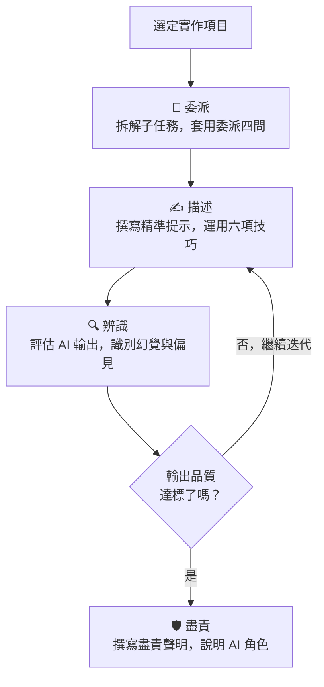
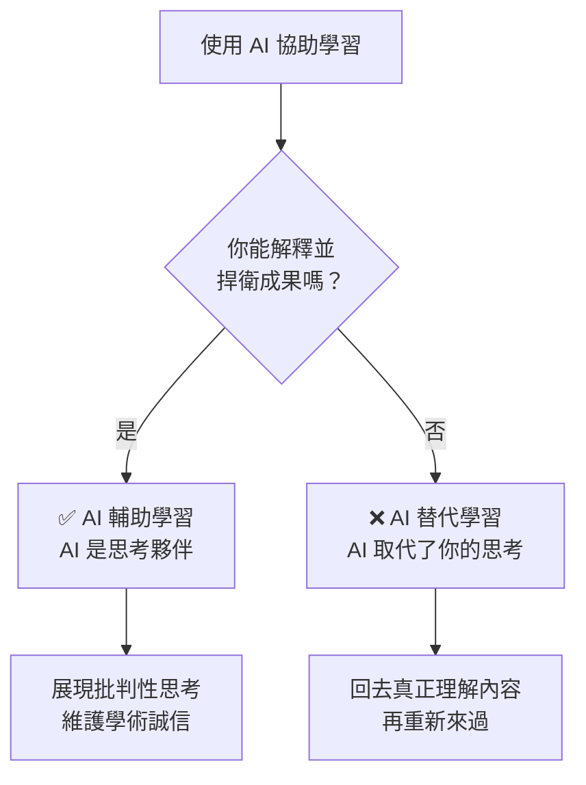

# 🎓 學生的 AI 素養

<Badge type="tip" text="⭐ 初學者" /> <Badge type="info" text="約 3 小時 · 5 課" /> <Badge type="warning" text="完成可獲證書" />

> **原始課程**：[AI Fluency for Students](https://anthropic.skilljar.com/ai-fluency-for-students)（英文）

## 📖 課程簡介

本課程專為**在學學生**設計，由 Anthropic 與學術專家 Prof. Joseph Feller（UCC）和 Prof. Rick Dakan（Ringling College）合作開發。

課程包含 **5 堂課**、約 3 小時學習內容，並附有大量實作練習。

課程的特別設計：你將在整個學習過程中，以一個**你自選的多步驟實際項目**（例如：準備一份簡報、撰寫一篇論文大綱、分析一個數據集）作為練習畫布，把 4Ds 框架直接應用在你的真實工作中。

這門課不是要教你「如何用 AI 少做一點功課」，而是幫助你學會**讓 AI 成為你學習旅程中最有力的思考夥伴**——同時維護學術誠信，並培養 AI 時代最有競爭力的能力。

## ⚠️ 前置條件

::: info 前置條件
**無必要前置條件。** 建議搭配 [AI 素養：框架與基礎](/ai-fluency/framework-foundations) 一起學習，以建立更完整的 4D 框架基礎。
:::

## 🎯 學習目標

完成本課程後，你將能夠：

- 運用 4D 框架（委派、描述、辨識、盡責）提升**學術研究**效率
- 建立「**委派計畫（Delegation Plan）**」拆解多步驟的學習任務
- 運用**描述—辨識循環**持續改善與 AI 的協作品質
- 以「**盡責聲明（Diligence Statement）**」透明說明 AI 在你工作中的角色
- 利用 AI 輔助**職涯規劃**與求職準備
- 識別 AI 的限制，培養**批判思考能力**

## 📋 課程大綱（5 堂課）

### 第 01 課：學生與 AI——建立共同語言

課程開場，建立你和 AI 協作的正確心態：

- AI 素養是什麼？為什麼學生特別需要它？——AI 素養不是「會用 ChatGPT」，而是能夠**有判斷力地**決定何時用、怎麼用、以及如何對結果負責。學生特別需要它，因為你現在建立的 AI 使用習慣，會直接影響你未來的職場競爭力。

- 學術誠信與 AI 使用的真正邊界（不是「禁止」，而是「負責任」）——真正的邊界不在於「有沒有用 AI」，而在於**你是否理解最終提交的內容、能否解釋和捍衛它**。用 AI 幫助你理解概念是素養；用 AI 替代你的思考過程是取巧。

- 4D 框架簡介：把委派、描述、辨識、盡責帶入你的學習習慣——這四個步驟讓你從「隨便丟問題給 AI」進化為「有策略地與 AI 協作」。

你也會選定本課程的**個人實作項目**——一個你即將進行的真實多步驟任務，作為整個課程的練習畫布。



### 第 02 課：委派——決定哪些工作交給 AI

這堂課的核心是**建立你的委派計畫**：

- 拆解你的實作項目為子任務——例如「撰寫一篇報告」可以拆成：蒐集資料、建立大綱、撰寫各章節初稿、校對、排版。拆得越細，你越能精準判斷哪些步驟需要自己做。

- 對每個子任務套用「委派四問」（任務是否明確？風險如何？需要獨特人類判斷嗎？能評估輸出嗎？）

  <details>
  <summary>詳細說明與範例</summary>

  以「蒐集資料」為例：
  **明確嗎？**（是，可以指定搜尋範圍和關鍵字）；
  **風險如何？**（中等，AI 可能提供不準確的來源）；
  **需要人類判斷？**（是，需要你判斷哪些來源可信）；
  **能評估輸出？**（是，你可以驗證來源是否真實）。
  結論：**適合人機協作**——讓 AI 協助初步蒐集，你負責驗證和篩選。

  </details>

- 決定哪些子任務可以委派給 AI，哪些需要你主導——一般原則：資料蒐集初步整理、格式化、翻譯等可以委派；核心論點的形成、個人經驗的連結、最終判斷必須由你主導。

**課程練習**：完成你的個人項目的完整委派計畫，清楚標出 AI 負責的部分、你負責的部分，以及需要人機協作的環節。

### 第 03 課：描述與辨識——執行你的委派計畫

進入實際執行階段：

- 運用六項提示技巧（背景、範例、限制、逐步推理、先思考、角色/語氣）描述你的任務——不要只說「幫我寫報告」，而是「我是大二經濟系學生，需要一份 2000 字的報告分析台灣通膨趨勢，受眾是教授，需引用 2023 年後的數據，使用 APA 格式」。

- 執行「描述—辨識循環」：AI 輸出後評估品質，根據評估調整提示，循環直到達標

  <details>
  <summary>詳細說明</summary>

  具體的循環過程：
  第一輪——送出提示，閱讀 AI 的完整輸出；
  第二輪——找出不滿意的地方（太籠統？事實有誤？漏掉重點？），把這些反饋加進新的提示中；
  第三輪——再次評估，直到達到你的標準。
  大多數任務需要 2-4 輪循環。關鍵心態：**第一次輸出幾乎永遠不是最佳結果**，迭代是正常的，不是 AI「不好用」的表現。

  </details>

- 識別輸出中的幻覺、偏見、不完整資訊——養成習慣：對每個 AI 輸出至少問三個問題：「這些事實是真的嗎？」「它有沒有遺漏其他觀點？」「它的結論依據充分嗎？」

**課程練習**：用描述—辨識循環完成你的委派計畫中的一個 AI 負責子任務，記錄你經歷了幾個循環才達到滿意的輸出。

### 第 04 課：盡責——對你的工作負責

這堂課回到最根本的問題：AI 幫你做了部分工作，但**你如何確保你對這份工作負責**？

- **盡責聲明的撰寫**：用一段簡短的說明，記錄 AI 在你的項目中扮演的角色，以及你如何確保最終品質——參見下方「重點筆記」中的盡責聲明範例。

- 學術誠信在 AI 時代的新詮釋：透明度不是弱點，而是能力展現——主動說明你使用了 AI 並清楚描述你的貢獻，反而展示了你的判斷力和誠實度，這比「假裝全是自己寫的」更受雇主和教授的尊重。

- 避免「AI 洗白」：即使加了修改，無批判性地提交 AI 輸出仍然有誠信問題

  <details>
  <summary>詳細說明</summary>

  「AI 洗白」指的是：讓 AI 生成完整內容，自己只做表面修改（改幾個詞、調整段落順序），然後當成自己的作品提交。即使技術上你「修改過」，但如果你沒有真正理解內容、沒有加入自己的判斷、也沒有驗證事實——這仍然是把 AI 的思考當成自己的，本質上與抄襲的問題一樣。真正負責任的做法是：在你提交的每一段內容中，你都能解釋為什麼這樣寫、依據是什麼。

  </details>

- 作為學生，你對 AI 輸出的最終責任是什麼——簡單標準：**如果教授或面試官問你這份作品的任何部分，你是否都能解釋和捍衛？** 如果不能，你對這部分的理解就不夠深，需要回去真正學會它。

### 第 05 課：職涯中的 AI 素養

向前看：你現在建立的 AI 素養，如何在職場中持續發揮價值：

- AI 如何改變各行各業的工作模式——從「人做所有事」轉向「人做判斷和創意，AI 處理執行和重複性工作」。這不只發生在科技業，幾乎所有知識工作者的工作流程都在被重新定義。

- 雇主最看重哪些「與 AI 協作」的能力

  <details>
  <summary>詳細說明</summary>

  雇主看重的不是「會用幾個 AI 工具」，而是：
  能**判斷何時該用 AI、何時不該用**的決策力；
  能撰寫精準提示並迭代優化的**溝通能力**；
  能批判性審核 AI 輸出的**辨識能力**；
  以及對 AI 協助的工作成果**負責任的態度**。
  換句話說，4D 框架的四個能力，正是雇主在 AI 時代最需要的人才特質。

  </details>

- 用 AI 探索職涯選項、準備面試、建立個人品牌——你可以請 AI 分析特定產業的趨勢和技能需求、模擬面試問答並給予回饋、優化你的履歷和自我介紹文案。但記住：AI 給的是通用建議，你的個人經歷和獨特觀點才是讓你脫穎而出的關鍵。

- AI 時代最有價值、最難被取代的人類能力——批判性思考、跨領域整合、人際同理心、創造性判斷、以及在不確定的情況下做出負責任決策的能力。這些正是 AI 最弱的地方，也是你在學生時期最值得刻意練習的。

## 📝 重點筆記

### ⚖️ AI 輔助學習 vs. AI 替代學習

| AI 輔助學習 ✅ | AI 替代學習 ❌ |
|--------------|--------------|
| 請 AI 解釋你不懂的概念，自己重新表述 | 讓 AI 直接給你答案，自己不思考 |
| 用 AI 生成練習題，自己作答再讓 AI 批改 | 讓 AI 代替你完成作業，自己只改格式 |
| 請 AI 提供反饋，自己修改並理解原因 | 直接提交 AI 生成的內容 |
| 用 AI 腦力激盪，再用自己的判斷篩選 | 用 AI「讀書」，自己完全不讀原始材料 |



### 📋 盡責聲明範例

```
關於 AI 使用的聲明：

本報告的初稿大綱由 Claude 3.7（Anthropic）在我的提示引導下生成，
我為每個章節提供了具體的背景資訊和研究目標。

初稿完成後，我對以下內容進行了批判性審閱和修改：
- 修正了第二節中兩個與原始資料不符的事實陳述
- 重寫了結論部分（AI 的建議不符合本研究的實際限制）
- 加入了我個人的訪談資料分析（AI 無法處理這部分）

最終提交的內容反映我的理解與判斷，我對其正確性負全責。
```

### 💎 AI 時代最有價值的學生能力

1. **批判性辨識**：評估 AI 輸出的品質、準確性與適用性
2. **精準描述**：設計出有效提示，引導 AI 提供真正有用的回應
3. **驗證習慣**：不輕易接受 AI 輸出，習慣交叉驗證重要資訊
4. **領域深度**：深厚的專業知識讓你能有效監督 AI 的輸出
5. **人際溝通**：AI 難以複製的情感連結、協作能力、說服力

### 📈 職場對 AI 素養的期望

雇主越來越期望：
- 能有效使用 AI 工具提升個人生產力
- 知道 AI 的邊界，不盲目依賴或過度信任
- 能透明、負責任地使用 AI，維護團隊和組織的聲譽
- 有能力評估 AI 輸出的品質（而不只是「會用」）

## 💡 學習建議

**實作練習（依照課程設計，選一個真實項目）：**

1. **建立委派計畫**：選一個你這週正在進行的多步驟學習任務（論文、報告、簡報），拆解為至少 5 個子任務，套用委派四問，建立你的個人委派計畫。

2. **執行描述—辨識循環**：針對你委派給 AI 的一個子任務，記錄你的提示迭代歷程——第一版提示 → AI 輸出 → 評估 → 修改提示 → 再次輸出，直到達到你的標準。

3. **撰寫盡責聲明**：完成 AI 協助的任務後，用 50–150 字撰寫你的盡責聲明，說明 AI 的角色和你的責任範圍。

**搭配學習：**
- 先完成 [AI 素養：框架與基礎](/ai-fluency/framework-foundations)
- 再試試 [Claude 101](/claude-products/claude-101) 實際操作

## 🔗 相關課程

- [AI 素養：框架與基礎](/ai-fluency/framework-foundations)（建議先修）
- [AI 能力與限制](/ai-fluency/capabilities-limitations)（理解 AI 的邊界）
- [Claude 101](/claude-products/claude-101)（實際操作 Claude）

## 🎯 互動練習

準備好測試你的理解了嗎？前往 [學生的 AI 素養互動練習](/ai-fluency/students-practice)，透過委派四問情境、輔助 vs. 替代分類、盡責聲明等題目鞏固本課程的核心概念。

## 📚 延伸閱讀

- [AI Fluency for Students 課程頁面](https://anthropic.skilljar.com/ai-fluency-for-students)（英文，原始課程）
- [AI Fluency Framework 官方網站](https://aifluencyframework.org/)（英文，含學生版 OER 資源）
- [Anthropic 教育報告：AI 素養指數](https://www.anthropic.com/research/AI-fluency-index)（英文，學生 AI 使用研究）

---

*本頁部分內容依據 [The AI Fluency Framework](https://aifluencyframework.org/)（Rick Dakan & Joseph Feller，與 Anthropic 合作開發）整理，原課程素材以 CC BY-NC-SA 4.0 授權發佈。*
