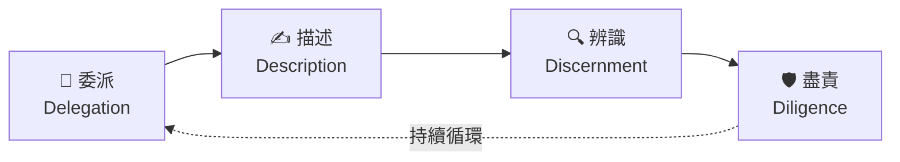
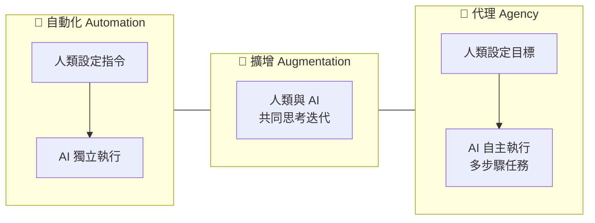
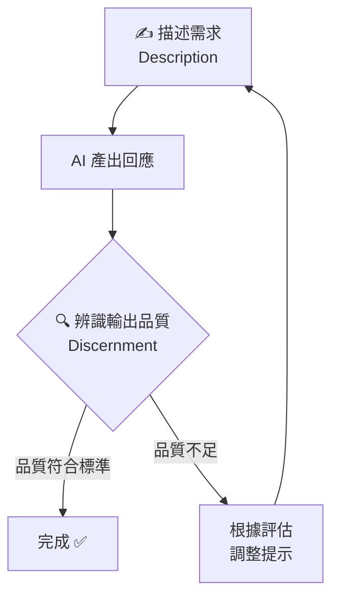
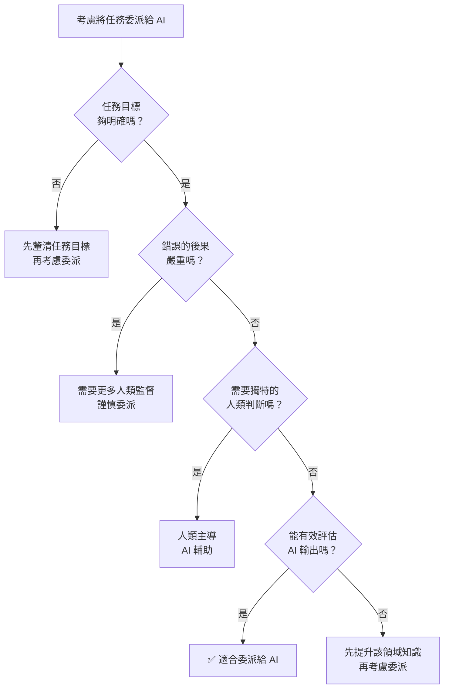

# 🧠 AI 素養：框架與基礎

<Badge type="tip" text="⭐ 初學者" /> <Badge type="info" text="3–4 小時 · 12 課" /> <Badge type="warning" text="完成可獲證書" />

> **原始課程**：[AI Fluency: Framework & Foundations](https://anthropic.skilljar.com/ai-fluency-framework-foundations)（英文）

## 📖 課程簡介

這是 Anthropic Academy 的**旗艦入門課程**，由 Anthropic 與兩位學術專家共同開發：
- **Prof. Joseph Feller**（University College Cork，愛爾蘭）
- **Prof. Rick Dakan**（Ringling College of Art and Design，美國）

課程包含 12 堂課、約 70 分鐘影片，並附有大量不計分的實作練習與參考講義。課程以「AI 素養框架（The AI Fluency Framework）」為核心，教你如何**有效、高效、合乎倫理且安全地**與 AI 系統協作。

適合所有背景的人——無論是 AI 新手還是已有使用經驗的人都能有所收穫。完成課程並通過測驗後，可取得 Anthropic 官方完成證書。

  <h4>📍 課程路線圖</h4>
  

    
AI 素養框架 <small>4D 的四大核心能力</small>

    
→

    
委派 <small>何時由人做？何時交給 AI？</small>

    
→

    
描述 <small>如何清楚與 AI 溝通？</small>

    
→

    
辨識 <small>如何評估 AI 的結果？</small>

    
→

    
盡責 <small>如何負責任地使用 AI？</small>

  

## ⚠️ 前置條件

::: info 前置條件
**無需任何前置知識。** 這是所有人的起點課程。
:::

## 🎯 學習目標

完成本課程後，你將能夠：

- 說明並應用 **4D AI 素養框架**（委派、描述、辨識、盡責）
- 識別三種 **人機互動模式**（自動化、擴增、代理）並選擇適合的模式
- 評估哪些工作任務應該**委派給 AI**，哪些應自行完成
- 設計精準的提示，運用六項**有效提示技巧**
- 批判性地評估 AI 輸出，善用**描述—辨識循環**持續改進
- 負責任地使用 AI，展現 Diligence（盡責）精神

  <h4>🎓 學習成果</h4>
  

    
建立思考 AI 互動的完整框架

    
具備在何時、如何與 AI 協作的判斷能力

    
掌握更流暢的人機協作實務技巧

    
自信地評估 AI 輸出並為結果負責

  

## 📋 課程大綱（12 堂課）

### 第 01 課：AI 素養簡介
課程開場，建立共同語言。介紹「AI 素養」的定義——不是技術技能，而是與 AI 系統有效協作的思維能力。說明為什麼所有人，無論職業背景，都需要培養 AI 素養。一位行銷人員、一位教師、一位工程師，都需要不同但同樣重要的 AI 素養——「會用 AI 工具」和「能有效、負責任地與 AI 協作」是截然不同的能力。

### 第 02 課：AI 素養框架
正式介紹核心架構：4Ds（委派、描述、辨識、盡責）與三種人機互動模式（自動化、擴增、代理）。這是整門課程的概念地圖，後續每一課都在擴展這張地圖。

詳細說明：4Ds 與互動模式如何搭配

4Ds 是你的**能力工具箱**，三種模式是你選擇的**協作情境**，兩者組合形成完整的 AI 素養框架。在「自動化」模式下（AI 獨立執行任務），委派和辨識最關鍵——你需要判斷任務是否適合委派，並在事後審核結果；在「擴增」模式下（人機共同思考），描述和辨識最常用——你不斷精煉提示，評估每次的輸出；在「代理」模式下（AI 自主完成多步驟任務），盡責和委派的策略設計尤為重要——因為錯誤的後果可能已造成影響再才被發現。掌握框架後，你就能根據任務性質選擇最合適的協作方式。

  <h4>🔍 深度探討系列（第 03、07、10 課）</h4>
  

    
🤖 什麼是生成式 AI？——不需技術背景的 AI 原理介紹

    
⚡ AI 的能力與限制——能力光譜、失敗模式與診斷修正

    
✍️ 有效提示技巧——六項提示技巧完整解析與實作練習

  

### 第 03 課：深度探討一：什麼是生成式 AI？
不需要技術背景的生成式 AI 原理介紹：語言模型如何運作、訓練資料如何影響輸出、模型的「知識截止日」是什麼意思。建立你判斷 AI 能力邊界所需的心智模型。

詳細說明

語言模型的核心是「根據前面的文字預測最可能的下一個詞」——反覆執行就能生成完整回應。這個簡單機制加上大規模訓練，讓模型具備了翻譯、推理、寫作等複雜能力。**但這也帶來兩個重要限制**：第一，模型的「知識」來自訓練資料，訓練截止日後的事件它完全不知道，且可能不會主動說明不確定性，而是產生聽起來合理但已過時的內容；第二，訓練資料中的偏見會被模型吸收，英文內容多於中文、主流觀點多於小眾觀點，冷門領域和特定文化脈絡的回應需要額外留意。了解這些基本原理，是後續第 04 課做出明智委派決策的知識基礎。

**補充重要術語（來自官方術語表）：**

- **上下文視窗（Context Window）**：AI 一次能「看到」的資訊總量，包含對話歷史和上傳的文件。超過上限後，最早的內容會被「遺忘」——這是 AI 的工作記憶，有上限，不是無限的。
- **溫度（Temperature）**：控制 AI 回應隨機程度的設定。數值越高，輸出越多元有創意；數值越低，輸出越一致可預測。
- **RAG（檢索增強生成，Retrieval Augmented Generation）**：讓 AI 連結外部知識來源（如搜尋結果、資料庫）的技術，可提升資訊準確度、減少幻覺。

### 第 04 課：委派（Delegation）
4Ds 的第一個 D。學習如何判斷哪些任務適合委派給 AI。委派包含三個層面：

- **目標與任務意識（Goal/Task Awareness）**：把複雜工作拆解成子任務，判斷哪些子任務適合 AI、哪些需要人類主導、哪些適合人機協作
- **平台意識（Platform Awareness）**：了解你使用的 AI 工具的能力範圍和限制，在不同工具和模式中選擇最合適的
- **任務委派（Task Delegation）**：運用「委派四問」（見下方重點筆記）進行快速評估，在 AI 能力和人類判斷之間找到最佳平衡

詳細說明與範例

以「準備一份季度業績報告」為例，委派決策可能是：**適合委派給 AI** 的部分——把原始數據整理成表格格式、草擬執行摘要的框架結構；**需要人類主導** 的部分——解讀數據背後的商業意涵、判斷哪些資訊對特定受眾最重要；**適合人機協作** 的部分——撰寫報告正文（AI 起草，人類審閱和修改）。委派不是「全部給 AI」或「全部自己做」，而是精準地在每個子任務上做出判斷。課程練習要求你把委派決策明確寫成一份計畫，讓你有意識地控制人機分工。

### 第 05 課：委派的應用
把委派原則帶入真實工作情境：練習用 Delegation 思維分解多步驟項目，建立你自己的「AI 委派計畫」（Delegation Plan）。

詳細說明：委派計畫如何建立

課程練習要求你選一個真實的多步驟工作項目（如：準備簡報、完成報告、設計課程），然後：**第一步**，列出所有子任務（越細越好，例如「蒐集資料→整理資料→分析資料→建立大綱→撰寫內容→校對→排版」）；**第二步**，對每個子任務套用委派四問，標記為「AI 執行 / 人類主導 / 人機協作」；**第三步**，規劃整個工作流程的人機交接點。你也可以把你的委派計畫分享給 Claude，讓它反饋哪些部分的委派設計可能帶來風險——用 AI 來幫助你改善如何使用 AI。

### 第 06 課：描述（Description）
4Ds 的第二個 D。有效地向 AI 描述你的目標——提示設計的核心原則。描述包含三個層面：

- **成果描述（Product Description）**：描述你想要的輸出內容、格式、品質標準——讓 AI 知道「好的輸出長什麼樣」
- **過程描述（Process Description）**：在對話過程中持續引導，根據輸出調整描述方向——對話是迭代的，不是一次性的
- **效能描述（Performance Description）**：在系統層面設定 AI 的行為準則和角色邊界（例如設定系統提示或在對話開頭定義 AI 的角色）

詳細說明與範例：從模糊到精準

**弱描述**：「幫我寫一封電子郵件給客戶。」

**強描述**：「我需要寫一封電子郵件給一位長期合作的 B2B 客戶，主題是本季交期會延遲兩週。語氣需要誠懇但不過度道歉，需說明原因（供應鏈問題）和補救方案（提供 5% 折扣）。長度控制在 200 字以內，格式是純文字，不要用條列式。」

差距在哪裡？強描述提供了：受眾背景（長期合作的 B2B 客戶）、核心訊息（延遲原因和補救方案）、語氣要求（誠懇但不過度道歉）、格式限制（200 字、純文字）。每一個細節都幫助 AI 縮小輸出範圍，讓結果更接近你真正需要的。

### 第 07 課：深度探討二：有效提示技巧
聚焦六項具體的提示技巧（完整列表見下方重點筆記），並透過大量示範對比「弱提示」與「強提示」的差異。這是課程中最多實作練習的一堂課。

詳細說明與範例

六項技巧在實際使用時往往組合出現。以「請 AI 分析一份商業計畫」為例：**背景（Context）**——「我是一位天使投資人，正在評估一份早期新創的商業計畫」；**範例（Examples）**——「請以這份範例分析報告的結構回應」；**限制（Constraints）**——「聚焦在財務可行性和市場規模，不需要分析技術實作細節」；**逐步推理（Step-by-step）**——「請先列出你的評估框架，再逐項分析」；**先思考（Think first）**——「在給出結論前，先列出你的假設和不確定點」；**角色（Role）**——「請以有 10 年 VC 投資經驗的分析師視角回應」。同時運用多項技巧，輸出品質會大幅優於只用一項的效果。

### 第 08 課：辨識（Discernment）
4Ds 的第三個 D。學習系統性評估 AI 輸出的方法。辨識包含三個層面：

- **成果辨識（Product Discernment）**：評估單一輸出的品質——事實是否準確？是否真的回答了你的問題？有沒有遺漏重要資訊或帶有偏見？
- **過程辨識（Process Discernment）**：評估整個人機協作是否有效——這個協作流程是否帶來了真正的價值提升，還是只是增加了工作量？
- **效能辨識（Performance Discernment）**：當 AI 作為自動化系統長期運作時，評估其整體表現是否持續達到預期標準

詳細說明：辨識不是懷疑一切

辨識的目的不是要你對每個 AI 輸出都深度懷疑，而是**建立有根據的判斷標準**。實用的風險分層做法：**高風險內容**（醫療、法律、財務建議，或對外公開發布的內容）——每個重要事實主張都要交叉驗證；**中風險內容**（內部分析草稿、工作文件）——整體邏輯和關鍵數據要核實；**低風險內容**（腦力激盪、格式整理）——快速瀏覽確認方向正確即可。特別需要警惕的三種問題：AI 引用不存在的來源（幻覺）、對不確定的事物表現得非常確定（過度確信）、技術上回答了問題但沒有解決你的真正需求（語境誤解）。

### 第 09 課：描述—辨識循環
把第 06 課（描述）與第 08 課（辨識）連結起來。介紹「描述—辨識循環（Description-Discernment Loop）」：根據 AI 輸出的品質調整提示，循環迭代直到達到你的標準。

詳細說明與範例

以「請 AI 幫你改寫一封說服性電子郵件」為例，循環的實際過程：**第一輪**——送出初版提示，閱讀輸出，發現內容太像範本、缺乏個人感；**辨識診斷**——問題是「過度概括」，原因是提示沒給足夠的脈絡；**調整描述**——加上收件人背景、過去的合作關係、這封信的特殊目的；**第二輪**——輸出明顯更個人化，但語氣偏過於正式；**再次調整**——指定語氣：「像跟認識三年的同事說話，不是正式商業信」；**第三輪**——達到標準。大多數任務需要 2-4 輪循環，這是正常的，不是 AI「不好用」的表現，而是與任何合作夥伴協作都需要的來回磨合。

### 第 10 課：盡責（Diligence）
4Ds 的第四個 D，也是最具倫理深度的一課。盡責包含三個層面：

- **創作盡責（Creation Diligence）**：在 AI 協助創作的過程中，主動辨識和減少偏見、確保內容準確，不讓 AI 的輸出取代人類的道德判斷
- **透明盡責（Transparency Diligence）**：在適當情況下揭露 AI 的參與——向客戶、雇主、受眾說明 AI 在你工作中扮演的角色
- **部署盡責（Deployment Diligence）**：在 AI 輸出公開使用前進行事實查核、測試，確認品質達到可對外負責的標準

詳細說明：盡責聲明範例

課程介紹的「盡責聲明（Diligence Statement）」是一種具體化盡責的工具——用一段話記錄 AI 在你的工作中扮演的角色，以及你如何確保最終品質。範例：

> 「本報告的初稿架構由 Claude（Anthropic）在作者的提示引導下生成。作者對所有事實陳述進行了獨立驗證，並重寫了結論部分（AI 的建議不符合本研究的實際限制）。最終內容反映作者的判斷，作者對其正確性負全責。」

盡責聲明通常 50-150 字，重點是說清楚三件事：AI 做了什麼、人類做了什麼、以及最終責任由誰承擔。Anthropic 本身也在此課程開發過程中使用了 AI，並在課程中透明揭露了這一點，以身作則示範盡責文化。

### 第 11 課：課程總結
整合 4Ds 與三種互動模式，建立一個完整的 AI 素養行動框架。回顧你在整門課程中的學習成果，為繼續深化做準備。這堂課也引導你建立**個人 AI 素養發展計畫**：評估自己在委派、描述、辨識、盡責四個面向各自的現有強度，設定下一步的練習重點。

### 第 12 課：延伸活動
提供進階練習與資源，供希望更深入應用的學習者使用。包含更複雜的情境模擬，以及如何把 AI 素養帶進你的工作或課堂。

詳細說明：延伸活動內容

延伸活動設計為開放式、自訂步調的深化練習，包含三類：**情境模擬**——面對更複雜的真實情境（例如：如何在高風險決策情境中使用 AI 協助、如何在團隊中建立共同的 AI 使用規範）；**跨領域應用**——把 4D 框架應用到你的特定領域（教育者可銜接「教育者的 AI 素養」、非營利從業者可銜接「非營利組織的 AI 素養」）；**個人素養評估**——回顧整個課程的學習歷程，評估你在四個 D 的成長，並設定下一階段的發展目標。

## 📝 重點筆記

### 🧩 什麼是 4D 框架？

4D 框架是 AI 素養的**四大核心能力**，每個 D 代表一種與 AI 協作時必備的行動：

| 能力 | 英文 | 定義 |
|------|------|------|
| **委派** | Delegation | 設定目標，決定是否、何時、以何種方式與 AI 合作 |
| **描述** | Description | 精準描述目標，引導 AI 產出有用的行為與輸出 |
| **辨識** | Discernment | 準確評估 AI 輸出和行為的有用程度 |
| **盡責** | Diligence | 對我們使用 AI 的方式以及 AI 的輸出負起責任 |

  

    

      
🏛️

      
有效 Effective

    

    

      
⏱️

      
高效 Efficient

    

    

      
⚖️

      
倫理 Ethical

    

    

      
🛡️

      
安全 Safe

    

  

::: tip 4Ds 與 EEES 的關係
課程的副標題是「有效、高效、合乎倫理且安全地（Effectively, Efficiently, Ethically, and Safely）」——這四個形容詞是**實踐 4Ds 之後所達成的結果**，而不是 4Ds 本身。熟練地委派、描述、辨識與盡責，就能讓你的 AI 使用達到有效、高效、倫理且安全的標準。
:::

### 🔄 三種人機互動模式

4Ds 框架不只適用於一種合作方式，而是橫跨三種人機互動模式：

| 模式 | 英文 | 說明 | 範例 |
|------|------|------|------|
| **自動化** | Automation | AI 根據人類指令執行特定任務 | 讓 AI 整理電子郵件分類 |
| **擴增** | Augmentation | 人類與 AI 作為思考夥伴共同協作 | 與 AI 腦力激盪、共同撰寫 |
| **代理** | Agency | 人類設定目標，AI 獨立執行未來的多步驟任務 | 讓 AI 代理管理行程排程 |

理解你在哪種模式下工作，有助於選擇最合適的 4Ds 應用方式。

### ✍️ 六項有效提示技巧

第 07 課深度探討這六項技巧，可搭配使用：

1. **提供背景（Context）**：說明任務的背景、目的、受眾
2. **給予範例（Examples）**：用具體的輸入/輸出範例展示你的期望
3. **設定限制（Constraints）**：指定格式、長度、語氣、禁忌事項
4. **要求逐步推理（Step-by-step reasoning）**：請 AI 一步一步思考，減少跳躍性錯誤
5. **請 AI 先思考（Think first）**：提示 AI 在回答之前先分析問題
6. **定義角色或語氣（Role / Tone）**：告訴 AI 應該以什麼角色或風格回應

### 🔁 描述—辨識循環

「描述—辨識循環」是課程的核心互動模型：

這個循環提醒我們：**好的 AI 使用不是一次性的完美提示，而是持續迭代的協作過程。**

### 📋 委派四問

每當考慮把任務委派給 AI 時，問自己：

1. **這個任務明確嗎？** AI 需要清晰的目標才能有效執行。
2. **錯誤的後果嚴重嗎？** 高風險任務需要更多人類監督。
3. **需要獨特的人類判斷嗎？** 若涉及個人經驗、價值觀或關係，人類介入可能不可或缺。
4. **我能有效評估輸出嗎？** 若你無法判斷好壞，委派可能帶來風險。

## 📺 NotebookLM 生成學習素材

以下內容由 Google NotebookLM 根據本課程第一課影片自動生成，供延伸學習使用。

::: info 🎬 影片摘要：AI Fluency Framework
**NotebookLM 影片概覽**（內容萃取自影片畫面，94 秒）

**故事主軸：從恐懼到夥伴**

| 時間點 | 畫面核心訊息 |
|--------|------------|
| 開場 | AI 已從「專業技術」快速滲透到學校與家庭等日常系統 |
| 問題點 | 我們都感受到「AI 的可能性」與「實際使用的直覺感」之間存在鴻溝 |
| 關鍵洞察 | 特定提示技巧（prompting fad）下個月就會過時；建立核心能力才能持久 |
| 思維轉變 | **THINKING ABOUT AI → THINKING WITH AI**（從旁觀者到協作者） |

**AI Fluency 定義**（影片原文）：
> *"The ability to engage with AI systems in ways that are **effective, efficient, ethical, and safe**."*

**4D 四步驟流程**（影片畫面）：
- Step 1 **Delegation** — When should humans do work and when should AI?
- Step 2 **Description** — How do we communicate clearly with AI systems?
- Step 3 **Discernment** — How do we evaluate what the AI gives us back?
- Step 4 **Diligence** — How to ensure your AI work is responsible?

**核心心態轉變**（影片結語）：
> *"Treat AI not as a **spellchecker**, but as a trusted partner for **creative problem-solving**."*
> *"The goal isn't to think **about** AI. It's to think **with** AI."*

**學完這門課你將獲得**（影片畫面 What You Gain）：
- 指引互動的完整框架
- 深思熟慮協作的技能
- 有效使用 AI 的信心
- 為結果負責的能力
- 應對未來變化的準備
:::

::: tip 📊 簡報：AI 流暢度核心概念（由 NotebookLM 生成）
以下為 NotebookLM 根據課程自動生成的繁體中文簡報關鍵頁面：
:::

  
  
為什麼需要框架？AI 能力與人類直覺之間存在日益擴大的落差。

  
  
戰術性技能 vs 核心素養：兩種截然不同的學習方向。

  
  
AI 流暢度的四個高標準：有效（Effective）、高效（Efficient）、道德（Ethical）、安全（Safe）。

  
  
4D 框架總覽：委派、描述、辨別、盡責，四大核心支柱。

  
  
4D 不是單向清單，而是持續迭代的互動循環，讓你真正「與 AI 共同思考」。

  
  
課程結語：準備好迎接的不只是今天的 AI 系統，而是未來無限的變革。

::: tip 🧪 延伸測驗：AI 流暢力測驗（10 題）
NotebookLM 根據課程內容自動生成 10 道繁體中文測驗題，涵蓋 4D 框架的核心概念、定義與應用情境。

前往 [**4D 互動練習頁 → NotebookLM 延伸測驗**](/ai-fluency/4d-practice#notebooklm-延伸測驗) 立即挑戰。
:::

## 💡 學習建議

> **想立即動手練習？** 前往 [**4D 互動練習頁**](/ai-fluency/4d-practice)，透過選擇題、情境題、提示改寫和盡責聲明產生器，鞏固你對 4D 框架的理解。

**自修練習（參考課程活動設計）：**

1. **委派計畫練習**：選一個你這個月的多步驟工作項目（如：準備一份簡報），列出所有子任務，逐一套用「委派四問」，決定哪些交給 AI、哪些自己做。

2. **描述—辨識循環練習**：針對同一個任務，寫出你的第一版提示，觀察輸出，找出 1–2 個可改善之處，修改提示後再試一次。記錄每一輪的差異。

3. **盡責聲明練習**：完成一個 AI 協助的工作後，寫一段 50–100 字的「盡責聲明」，說明 AI 在其中扮演的角色，以及你如何確保最終輸出的品質與準確性。

**搭配學習：**
- 完成本課程後，繼續 [AI 能力與限制](/ai-fluency/capabilities-limitations) 課程深化理解
- 如果你是教育者，接著看 [教育者的 AI 素養](/ai-fluency/for-educators)
- 如果你是學生，接著看 [學生的 AI 素養](/ai-fluency/for-students)

## 🔗 相關課程

- [AI 能力與限制](/ai-fluency/capabilities-limitations)（本課程的最佳搭配）
- [Claude 101](/claude-products/claude-101)（實際操作 Claude 的入門課）
- [教育者的 AI 素養](/ai-fluency/for-educators)（教育者進階）
- [學生的 AI 素養](/ai-fluency/for-students)（學生視角）

## 📚 延伸閱讀

- [AI Fluency Framework 官方網站](https://aifluencyframework.org/)（英文，含課程 OER 資源）
- [OpenCourses.ie 課程頁面](https://opencourses.ie/opencourse/ai-fluency-framework-foundations/)（英文，CC BY-NC-SA 4.0 授權，可自由取用）
- [Anthropic 學習頁面](https://www.anthropic.com/learn/claude-for-you)（英文，官方課程介紹）
- [Disco.co：4D 框架詳解](https://www.disco.co/blog/anthropics-ai-fluency-course-how-to-upskill-your-org-with-the-4d-framework)（英文，第三方評測）

---

*本頁部分內容依據 [The AI Fluency Framework](https://aifluencyframework.org/)（Rick Dakan & Joseph Feller，與 Anthropic 合作開發）整理，原課程素材以 CC BY-NC-SA 4.0 授權發佈。*
