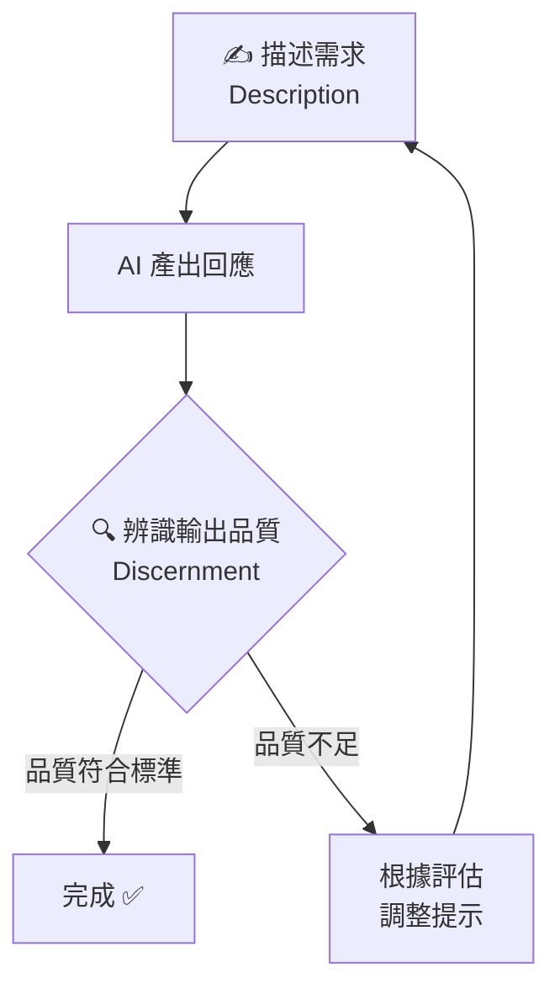
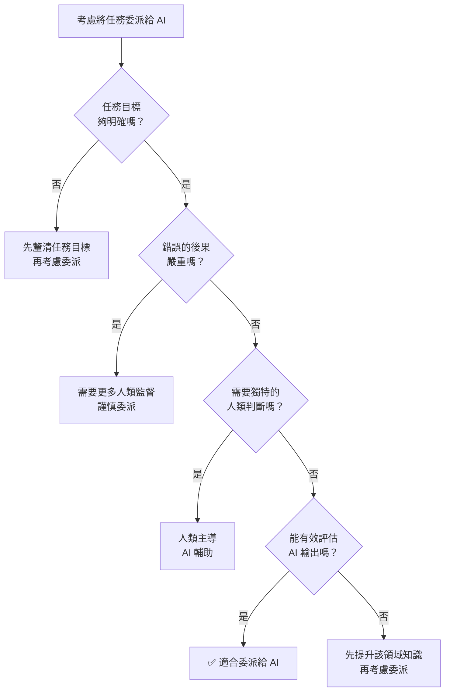

# 🧠 AI 素養：框架與基礎

<Badge type="tip" text="⭐ 初學者" /> <Badge type="info" text="3–4 小時 · 12 課" /> <Badge type="warning" text="完成可獲證書" />

> **原始課程**：[AI Fluency: Framework & Foundations](https://anthropic.skilljar.com/ai-fluency-framework-foundations)（英文）

## 📖 課程簡介

這是 Anthropic Academy 的**旗艦入門課程**，由 Anthropic 與兩位學術專家共同開發：
- **Prof. Joseph Feller**（University College Cork，愛爾蘭）
- **Prof. Rick Dakan**（Ringling College of Art and Design，美國）

課程包含 12 堂課、約 70 分鐘影片，並附有大量不計分的實作練習與參考講義。課程以「AI 素養框架（The AI Fluency Framework）」為核心，教你如何**有效、高效、合乎倫理且安全地**與 AI 系統協作。

適合所有背景的人——無論是 AI 新手還是已有使用經驗的人都能有所收穫。完成課程並通過測驗後，可取得 Anthropic 官方完成證書。

  <h4>📍 課程路線圖</h4>
  

    
AI 素養框架 <small>4D 的四大核心能力</small>

    
→

    
委派 <small>何時由人做？何時交給 AI？</small>

    
→

    
描述 <small>如何清楚與 AI 溝通？</small>

    
→

    
辨識 <small>如何評估 AI 的結果？</small>

    
→

    
盡責 <small>如何負責任地使用 AI？</small>

  

## ⚠️ 前置條件

::: info 前置條件
**無需任何前置知識。** 這是所有人的起點課程。
:::

## 🎯 學習目標

完成本課程後，你將能夠：

- 說明並應用 **4D AI 素養框架**（委派、描述、辨識、盡責）
- 識別三種 **人機互動模式**（自動化、擴增、代理）並選擇適合的模式
- 評估哪些工作任務應該**委派給 AI**，哪些應自行完成
- 設計精準的提示，運用六項**有效提示技巧**
- 批判性地評估 AI 輸出，善用**描述—辨識循環**持續改進
- 負責任地使用 AI，展現 Diligence（盡責）精神

  <h4>🎓 學習成果</h4>
  

    
建立思考 AI 互動的完整框架

    
具備在何時、如何與 AI 協作的判斷能力

    
掌握更流暢的人機協作實務技巧

    
自信地評估 AI 輸出並為結果負責

  

## 📋 課程大綱（12 堂課）

  <h4>🔍 深度探討系列（第 03、07、10 課）</h4>
  

    
🤖 什麼是生成式 AI？——不需技術背景的 AI 原理介紹

    
⚡ AI 的能力與限制——能力光譜、失敗模式與診斷修正

    
✍️ 有效提示技巧——六項提示技巧完整解析與實作練習

  

### 第 03 課：深度探討一：什麼是生成式 AI？
不需要技術背景的生成式 AI 原理介紹：語言模型如何運作、訓練資料如何影響輸出、模型的「知識截止日」是什麼意思。建立你判斷 AI 能力邊界所需的心智模型——掌握上下文視窗、幻覺、溫度、RAG 等關鍵概念，是後續委派決策的知識基礎。

→ [📓 查看完整影音、簡報與測驗](/ai-fluency/framework-nlm-03)

### 第 04 課：委派（Delegation）
4Ds 的第一個 D。學習如何判斷哪些任務適合委派給 AI。委派包含三個層面：

- **目標與任務意識（Goal/Task Awareness）**：把複雜工作拆解成子任務，判斷哪些子任務適合 AI、哪些需要人類主導、哪些適合人機協作
- **平台意識（Platform Awareness）**：了解你使用的 AI 工具的能力範圍和限制，在不同工具和模式中選擇最合適的
- **任務委派（Task Delegation）**：運用「委派四問」（見下方重點筆記）進行快速評估，在 AI 能力和人類判斷之間找到最佳平衡

詳細說明與範例

以「準備一份季度業績報告」為例，委派決策可能是：  
**適合委派給 AI** 的部分——把原始數據整理成表格格式、草擬執行摘要的框架結構；  
**需要人類主導** 的部分——解讀數據背後的商業意涵、判斷哪些資訊對特定受眾最重要；  
**適合人機協作** 的部分——撰寫報告正文（AI 起草，人類審閱和修改）。  
委派不是「全部給 AI」或「全部自己做」，而是精準地在每個子任務上做出判斷。課程練習要求你把委派決策明確寫成一份計畫，讓你有意識地控制人機分工。

### 第 05 課：委派的應用
把委派原則帶入真實工作情境：練習用 Delegation 思維分解多步驟項目，建立你自己的「AI 委派計畫」（Delegation Plan）。

詳細說明：委派計畫如何建立

課程練習要求你選一個真實的多步驟工作項目（如：準備簡報、完成報告、設計課程），然後：  
**第一步**，列出所有子任務（越細越好，例如「蒐集資料→整理資料→分析資料→建立大綱→撰寫內容→校對→排版」）；  
**第二步**，對每個子任務套用委派四問，標記為「AI 執行 / 人類主導 / 人機協作」；  
**第三步**，規劃整個工作流程的人機交接點。  
你也可以把你的委派計畫分享給 Claude，讓它反饋哪些部分的委派設計可能帶來風險——用 AI 來幫助你改善如何使用 AI。

### 第 06 課：描述（Description）
4Ds 的第二個 D。有效地向 AI 描述你的目標——提示設計的核心原則。描述包含三個層面：

- **成果描述（Product Description）**：描述你想要的輸出內容、格式、品質標準——讓 AI 知道「好的輸出長什麼樣」
- **過程描述（Process Description）**：在對話過程中持續引導，根據輸出調整描述方向——對話是迭代的，不是一次性的
- **效能描述（Performance Description）**：在系統層面設定 AI 的行為準則和角色邊界（例如設定系統提示或在對話開頭定義 AI 的角色）

詳細說明與範例：從模糊到精準

**弱描述**：「幫我寫一封電子郵件給客戶。」

**強描述**：「我需要寫一封電子郵件給一位長期合作的 B2B 客戶，主題是本季交期會延遲兩週。語氣需要誠懇但不過度道歉，需說明原因（供應鏈問題）和補救方案（提供 5% 折扣）。長度控制在 200 字以內，格式是純文字，不要用條列式。」

差距在哪裡？強描述提供了：受眾背景（長期合作的 B2B 客戶）、核心訊息（延遲原因和補救方案）、語氣要求（誠懇但不過度道歉）、格式限制（200 字、純文字）。每一個細節都幫助 AI 縮小輸出範圍，讓結果更接近你真正需要的。

### 第 07 課：深度探討二：有效提示技巧
聚焦六項具體的提示技巧（完整列表見下方重點筆記），並透過大量示範對比「弱提示」與「強提示」的差異。這是課程中最多實作練習的一堂課。

詳細說明與範例

六項技巧在實際使用時往往組合出現。以「請 AI 分析一份商業計畫」為例：  
**背景（Context）**——「我是一位天使投資人，正在評估一份早期新創的商業計畫」；  
**範例（Examples）**——「請以這份範例分析報告的結構回應」；  
**限制（Constraints）**——「聚焦在財務可行性和市場規模，不需要分析技術實作細節」；  
**逐步推理（Step-by-step）**——「請先列出你的評估框架，再逐項分析」；  
**先思考（Think first）**——「在給出結論前，先列出你的假設和不確定點」；  
**角色（Role）**——「請以有 10 年 VC 投資經驗的分析師視角回應」。  
同時運用多項技巧，輸出品質會大幅優於只用一項的效果。

### 第 08 課：辨識（Discernment）
4Ds 的第三個 D。學習系統性評估 AI 輸出的方法。辨識包含三個層面：

- **成果辨識（Product Discernment）**：評估單一輸出的品質——事實是否準確？是否真的回答了你的問題？有沒有遺漏重要資訊或帶有偏見？
- **過程辨識（Process Discernment）**：評估整個人機協作是否有效——這個協作流程是否帶來了真正的價值提升，還是只是增加了工作量？
- **效能辨識（Performance Discernment）**：當 AI 作為自動化系統長期運作時，評估其整體表現是否持續達到預期標準

詳細說明：辨識不是懷疑一切

辨識的目的不是要你對每個 AI 輸出都深度懷疑，而是**建立有根據的判斷標準**。實用的風險分層做法：  
**高風險內容**（醫療、法律、財務建議，或對外公開發布的內容）——每個重要事實主張都要交叉驗證；  
**中風險內容**（內部分析草稿、工作文件）——整體邏輯和關鍵數據要核實；  
**低風險內容**（腦力激盪、格式整理）——快速瀏覽確認方向正確即可。  
特別需要警惕的三種問題：AI 引用不存在的來源（幻覺）、對不確定的事物表現得非常確定（過度確信）、技術上回答了問題但沒有解決你的真正需求（語境誤解）。

### 第 09 課：描述—辨識循環
把第 06 課（描述）與第 08 課（辨識）連結起來。介紹「描述—辨識循環（Description-Discernment Loop）」：根據 AI 輸出的品質調整提示，循環迭代直到達到你的標準。

詳細說明與範例

以「請 AI 幫你改寫一封說服性電子郵件」為例，循環的實際過程：  
**第一輪**——送出初版提示，閱讀輸出，發現內容太像範本、缺乏個人感；  
**辨識診斷**——問題是「過度概括」，原因是提示沒給足夠的脈絡；  
**調整描述**——加上收件人背景、過去的合作關係、這封信的特殊目的；  
**第二輪**——輸出明顯更個人化，但語氣偏過於正式；  
**再次調整**——指定語氣：「像跟認識三年的同事說話，不是正式商業信」；  
**第三輪**——達到標準。  
大多數任務需要 2-4 輪循環，這是正常的，不是 AI「不好用」的表現，而是與任何合作夥伴協作都需要的來回磨合。

### 第 10 課：盡責（Diligence）
4Ds 的第四個 D，也是最具倫理深度的一課。盡責包含三個層面：

- **創作盡責（Creation Diligence）**：在 AI 協助創作的過程中，主動辨識和減少偏見、確保內容準確，不讓 AI 的輸出取代人類的道德判斷
- **透明盡責（Transparency Diligence）**：在適當情況下揭露 AI 的參與——向客戶、雇主、受眾說明 AI 在你工作中扮演的角色
- **部署盡責（Deployment Diligence）**：在 AI 輸出公開使用前進行事實查核、測試，確認品質達到可對外負責的標準

詳細說明：盡責聲明範例

課程介紹的「盡責聲明（Diligence Statement）」是一種具體化盡責的工具——用一段話記錄 AI 在你的工作中扮演的角色，以及你如何確保最終品質。範例：

> 「本報告的初稿架構由 Claude（Anthropic）在作者的提示引導下生成。作者對所有事實陳述進行了獨立驗證，並重寫了結論部分（AI 的建議不符合本研究的實際限制）。最終內容反映作者的判斷，作者對其正確性負全責。」

盡責聲明通常 50-150 字，重點是說清楚三件事：AI 做了什麼、人類做了什麼、以及最終責任由誰承擔。Anthropic 本身也在此課程開發過程中使用了 AI，並在課程中透明揭露了這一點，以身作則示範盡責文化。

### 第 11 課：課程總結
整合 4Ds 與三種互動模式，建立一個完整的 AI 素養行動框架。回顧你在整門課程中的學習成果，為繼續深化做準備。這堂課也引導你建立**個人 AI 素養發展計畫**：評估自己在委派、描述、辨識、盡責四個面向各自的現有強度，設定下一步的練習重點。

### 第 12 課：延伸活動
提供進階練習與資源，供希望更深入應用的學習者使用。包含更複雜的情境模擬，以及如何把 AI 素養帶進你的工作或課堂。

詳細說明：延伸活動內容

延伸活動設計為開放式、自訂步調的深化練習，包含三類：  
**情境模擬**——面對更複雜的真實情境（例如：如何在高風險決策情境中使用 AI 協助、如何在團隊中建立共同的 AI 使用規範）；  
**跨領域應用**——把 4D 框架應用到你的特定領域（教育者可銜接「教育者的 AI 素養」、非營利從業者可銜接「非營利組織的 AI 素養」）；  
**個人素養評估**——回顧整個課程的學習歷程，評估你在四個 D 的成長，並設定下一階段的發展目標。

## 📝 重點筆記

### ✍️ 六項有效提示技巧

第 07 課深度探討這六項技巧，可搭配使用：

1. **提供背景（Context）**：說明任務的背景、目的、受眾
2. **給予範例（Examples）**：用具體的輸入/輸出範例展示你的期望
3. **設定限制（Constraints）**：指定格式、長度、語氣、禁忌事項
4. **要求逐步推理（Step-by-step reasoning）**：請 AI 一步一步思考，減少跳躍性錯誤
5. **請 AI 先思考（Think first）**：提示 AI 在回答之前先分析問題
6. **定義角色或語氣（Role / Tone）**：告訴 AI 應該以什麼角色或風格回應

### 🔁 描述—辨識循環

「描述—辨識循環」是課程的核心互動模型：

這個循環提醒我們：**好的 AI 使用不是一次性的完美提示，而是持續迭代的協作過程。**

### 📋 委派四問

每當考慮把任務委派給 AI 時，問自己：

1. **這個任務明確嗎？** AI 需要清晰的目標才能有效執行。
2. **錯誤的後果嚴重嗎？** 高風險任務需要更多人類監督。
3. **需要獨特的人類判斷嗎？** 若涉及個人經驗、價值觀或關係，人類介入可能不可或缺。
4. **我能有效評估輸出嗎？** 若你無法判斷好壞，委派可能帶來風險。

## 💡 學習建議

> **想立即動手練習？** 前往 [**4D 互動練習頁**](/ai-fluency/4d-practice)，透過選擇題、情境題、提示改寫和盡責聲明產生器，鞏固你對 4D 框架的理解。

**自修練習（參考課程活動設計）：**

1. **委派計畫練習**：選一個你這個月的多步驟工作項目（如：準備一份簡報），列出所有子任務，逐一套用「委派四問」，決定哪些交給 AI、哪些自己做。

2. **描述—辨識循環練習**：針對同一個任務，寫出你的第一版提示，觀察輸出，找出 1–2 個可改善之處，修改提示後再試一次。記錄每一輪的差異。

3. **盡責聲明練習**：完成一個 AI 協助的工作後，寫一段 50–100 字的「盡責聲明」，說明 AI 在其中扮演的角色，以及你如何確保最終輸出的品質與準確性。

**搭配學習：**
- 完成本課程後，繼續 [AI 能力與限制](/ai-fluency/capabilities-limitations) 課程深化理解
- 如果你是教育者，接著看 [教育者的 AI 素養](/ai-fluency/for-educators)
- 如果你是學生，接著看 [學生的 AI 素養](/ai-fluency/for-students)

## 🔗 相關課程

- [AI 能力與限制](/ai-fluency/capabilities-limitations)（本課程的最佳搭配）
- [Claude 101](/claude-products/claude-101)（實際操作 Claude 的入門課）
- [教育者的 AI 素養](/ai-fluency/for-educators)（教育者進階）
- [學生的 AI 素養](/ai-fluency/for-students)（學生視角）

## 📚 延伸閱讀

- [AI Fluency Framework 官方網站](https://aifluencyframework.org/)（英文，含課程 OER 資源）
- [OpenCourses.ie 課程頁面](https://opencourses.ie/opencourse/ai-fluency-framework-foundations/)（英文，CC BY-NC-SA 4.0 授權，可自由取用）
- [Anthropic 學習頁面](https://www.anthropic.com/learn/claude-for-you)（英文，官方課程介紹）
- [Disco.co：4D 框架詳解](https://www.disco.co/blog/anthropics-ai-fluency-course-how-to-upskill-your-org-with-the-4d-framework)（英文，第三方評測）

---

*本頁部分內容依據 [The AI Fluency Framework](https://aifluencyframework.org/)（Rick Dakan & Joseph Feller，與 Anthropic 合作開發）整理，原課程素材以 CC BY-NC-SA 4.0 授權發佈。*
