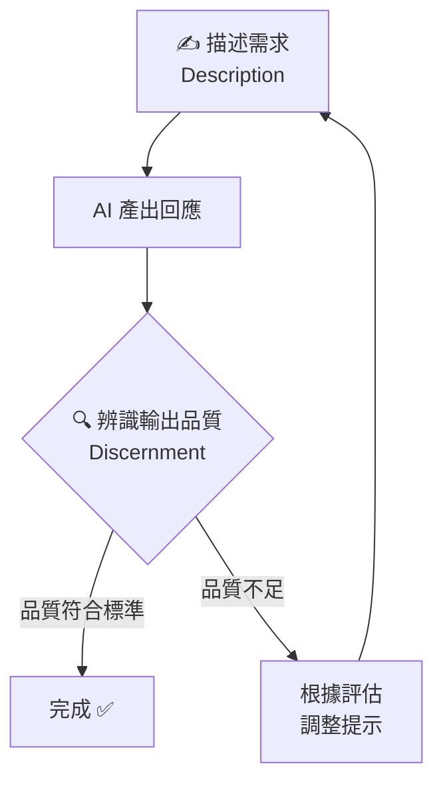
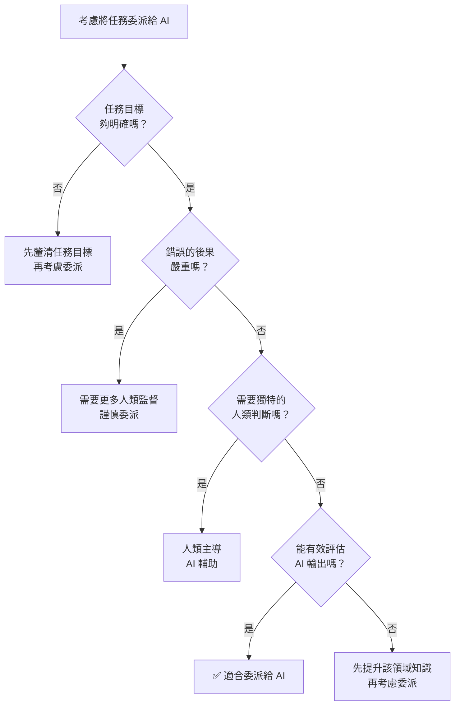

# 🧠 AI 素養：框架與基礎

<Badge type="tip" text="⭐ 初學者" /> <Badge type="info" text="3–4 小時 · 12 課" /> <Badge type="warning" text="完成可獲證書" />

> **原始課程**：[AI Fluency: Framework & Foundations](https://anthropic.skilljar.com/ai-fluency-framework-foundations)（英文）

## 📖 課程簡介

這是 Anthropic Academy 的**旗艦入門課程**，由 Anthropic 與兩位學術專家共同開發：
- **Prof. Joseph Feller**（University College Cork，愛爾蘭）
- **Prof. Rick Dakan**（Ringling College of Art and Design，美國）

課程包含 12 堂課、約 70 分鐘影片，並附有大量不計分的實作練習與參考講義。課程以「AI 素養框架（The AI Fluency Framework）」為核心，教你如何**有效、高效、合乎倫理且安全地**與 AI 系統協作。

適合所有背景的人——無論是 AI 新手還是已有使用經驗的人都能有所收穫。完成課程並通過測驗後，可取得 Anthropic 官方完成證書。

  <h4>📍 課程路線圖</h4>
  

    
AI 素養框架 <small>4D 的四大核心能力</small>

    
→

    
委派 <small>何時由人做？何時交給 AI？</small>

    
→

    
描述 <small>如何清楚與 AI 溝通？</small>

    
→

    
辨識 <small>如何評估 AI 的結果？</small>

    
→

    
盡責 <small>如何負責任地使用 AI？</small>

  

## ⚠️ 前置條件

::: info 前置條件
**無需任何前置知識。** 這是所有人的起點課程。
:::

## 🎯 學習目標

完成本課程後，你將能夠：

- 說明並應用 **4D AI 素養框架**（委派、描述、辨識、盡責）
- 識別三種 **人機互動模式**（自動化、擴增、代理）並選擇適合的模式
- 評估哪些工作任務應該**委派給 AI**，哪些應自行完成
- 設計精準的提示，運用六項**有效提示技巧**
- 批判性地評估 AI 輸出，善用**描述—辨識循環**持續改進
- 負責任地使用 AI，展現 Diligence（盡責）精神

  <h4>🎓 學習成果</h4>
  

    
建立思考 AI 互動的完整框架

    
具備在何時、如何與 AI 協作的判斷能力

    
掌握更流暢的人機協作實務技巧

    
自信地評估 AI 輸出並為結果負責

  

## 📋 課程大綱（12 堂課）

  <h4>🔍 深度探討系列（第 03、07、10 課）</h4>
  

    
🤖 什麼是生成式 AI？——不需技術背景的 AI 原理介紹

    
⚡ AI 的能力與限制——能力光譜、失敗模式與診斷修正

    
✍️ 有效提示技巧——六項提示技巧完整解析與實作練習

  

## 📝 重點筆記

### ✍️ 六項有效提示技巧

第 07 課深度探討這六項技巧，可搭配使用：

1. **提供背景（Context）**：說明任務的背景、目的、受眾
2. **給予範例（Examples）**：用具體的輸入/輸出範例展示你的期望
3. **設定限制（Constraints）**：指定格式、長度、語氣、禁忌事項
4. **要求逐步推理（Step-by-step reasoning）**：請 AI 一步一步思考，減少跳躍性錯誤
5. **請 AI 先思考（Think first）**：提示 AI 在回答之前先分析問題
6. **定義角色或語氣（Role / Tone）**：告訴 AI 應該以什麼角色或風格回應

### 🔁 描述—辨識循環

「描述—辨識循環」是課程的核心互動模型：

這個循環提醒我們：**好的 AI 使用不是一次性的完美提示，而是持續迭代的協作過程。**

### 📋 委派四問

每當考慮把任務委派給 AI 時，問自己：

1. **這個任務明確嗎？** AI 需要清晰的目標才能有效執行。
2. **錯誤的後果嚴重嗎？** 高風險任務需要更多人類監督。
3. **需要獨特的人類判斷嗎？** 若涉及個人經驗、價值觀或關係，人類介入可能不可或缺。
4. **我能有效評估輸出嗎？** 若你無法判斷好壞，委派可能帶來風險。

## 💡 學習建議

> **想立即動手練習？** 前往 [**4D 互動練習頁**](/ai-fluency/4d-practice)，透過選擇題、情境題、提示改寫和盡責聲明產生器，鞏固你對 4D 框架的理解。

**自修練習（參考課程活動設計）：**

1. **委派計畫練習**：選一個你這個月的多步驟工作項目（如：準備一份簡報），列出所有子任務，逐一套用「委派四問」，決定哪些交給 AI、哪些自己做。

2. **描述—辨識循環練習**：針對同一個任務，寫出你的第一版提示，觀察輸出，找出 1–2 個可改善之處，修改提示後再試一次。記錄每一輪的差異。

3. **盡責聲明練習**：完成一個 AI 協助的工作後，寫一段 50–100 字的「盡責聲明」，說明 AI 在其中扮演的角色，以及你如何確保最終輸出的品質與準確性。

**搭配學習：**
- 完成本課程後，繼續 [AI 能力與限制](/ai-fluency/capabilities-limitations) 課程深化理解
- 如果你是教育者，接著看 [教育者的 AI 素養](/ai-fluency/for-educators)
- 如果你是學生，接著看 [學生的 AI 素養](/ai-fluency/for-students)

## 🔗 相關課程

- [AI 能力與限制](/ai-fluency/capabilities-limitations)（本課程的最佳搭配）
- [Claude 101](/claude-products/claude-101)（實際操作 Claude 的入門課）
- [教育者的 AI 素養](/ai-fluency/for-educators)（教育者進階）
- [學生的 AI 素養](/ai-fluency/for-students)（學生視角）

## 📚 延伸閱讀

- [AI Fluency Framework 官方網站](https://aifluencyframework.org/)（英文，含課程 OER 資源）
- [OpenCourses.ie 課程頁面](https://opencourses.ie/opencourse/ai-fluency-framework-foundations/)（英文，CC BY-NC-SA 4.0 授權，可自由取用）
- [Anthropic 學習頁面](https://www.anthropic.com/learn/claude-for-you)（英文，官方課程介紹）
- [Disco.co：4D 框架詳解](https://www.disco.co/blog/anthropics-ai-fluency-course-how-to-upskill-your-org-with-the-4d-framework)（英文，第三方評測）

---

*本頁部分內容依據 [The AI Fluency Framework](https://aifluencyframework.org/)（Rick Dakan & Joseph Feller，與 Anthropic 合作開發）整理，原課程素材以 CC BY-NC-SA 4.0 授權發佈。*
