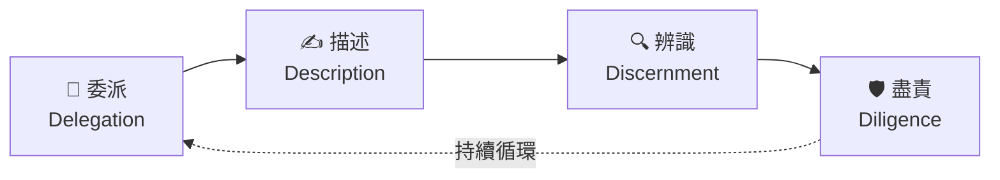
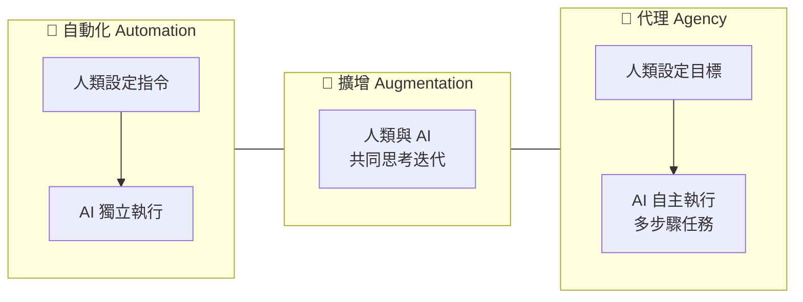

# 📓 第 02 課：4D 框架詳解

<Badge type="tip" text="NotebookLM 生成" /> <Badge type="info" text="影片摘要 + 簡報 + 測驗" />

> 以下內容由 Google NotebookLM 根據課程影片「The 4D Framework」自動生成，作為延伸濃縮學習素材。  
> 📖 回到主課程：[AI 素養：框架與基礎](/ai-fluency/framework-foundations)

## 📋 課程概覽

### 第 02 課：AI 素養框架

正式介紹核心架構：4Ds（委派、描述、辨識、盡責）與三種人機互動模式（自動化、擴增、代理）。這是整門課程的概念地圖，後續每一課都在擴展這張地圖。

詳細說明：4Ds 與互動模式如何搭配

4Ds 是你的**能力工具箱**，三種模式是你選擇的**協作情境**，兩者組合形成完整的 AI 素養框架。  
在「自動化」模式下（AI 獨立執行任務），委派和辨識最關鍵——你需要判斷任務是否適合委派，並在事後審核結果；  
在「擴增」模式下（人機共同思考），描述和辨識最常用——你不斷精煉提示，評估每次的輸出；  
在「代理」模式下（AI 自主完成多步驟任務），盡責和委派的策略設計尤為重要——因為錯誤的後果可能已造成影響再才被發現。  
掌握框架後，你就能根據任務性質選擇最合適的協作方式。

## 📝 重點筆記

### 🧩 什麼是 4D 框架？

4D 框架是 AI 素養的**四大核心能力**，每個 D 代表一種與 AI 協作時必備的行動：

| 能力 | 英文 | 定義 |
|------|------|------|
| **委派** | Delegation | 設定目標，決定是否、何時、以何種方式與 AI 合作 |
| **描述** | Description | 精準描述目標，引導 AI 產出有用的行為與輸出 |
| **辨識** | Discernment | 準確評估 AI 輸出和行為的有用程度 |
| **盡責** | Diligence | 對我們使用 AI 的方式以及 AI 的輸出負起責任 |

  

    

      
🏛️

      
有效 Effective

    

    

      
⏱️

      
高效 Efficient

    

    

      
⚖️

      
倫理 Ethical

    

    

      
🛡️

      
安全 Safe

    

  

::: tip 4Ds 與 EEES 的關係
課程的副標題是「有效、高效、合乎倫理且安全地（Effectively, Efficiently, Ethically, and Safely）」——這四個形容詞是**實踐 4Ds 之後所達成的結果**，而不是 4Ds 本身。熟練地委派、描述、辨識與盡責，就能讓你的 AI 使用達到有效、高效、倫理且安全的標準。
:::

### 🔄 三種人機互動模式

4Ds 框架不只適用於一種合作方式，而是橫跨三種人機互動模式：

| 模式 | 英文 | 說明 | 範例 |
|------|------|------|------|
| **自動化** | Automation | AI 根據人類指令執行特定任務 | 讓 AI 整理電子郵件分類 |
| **擴增** | Augmentation | 人類與 AI 作為思考夥伴共同協作 | 與 AI 腦力激盪、共同撰寫 |
| **代理** | Agency | 人類設定目標，AI 獨立執行未來的多步驟任務 | 讓 AI 代理管理行程排程 |

理解你在哪種模式下工作，有助於選擇最合適的 4Ds 應用方式。

## 🧩 暖身：4D 概念選擇題

確認你對四個 D 的核心定義有正確的理解。

### 練習 1-1

<Quiz
  question="「準確評估 AI 輸出和行為的有用程度」是哪個 D 的定義？"
  :options="quizOptions1"
  :answer="2"
  explanation="Discernment（辨識）的核心是批判性評估 AI 的輸出——不是懷疑一切，而是有根據地判斷哪些輸出可用、哪些需要修正。委派是決策層面，描述是輸入層面，盡責是責任層面。"
/>

### 練習 1-2

<Quiz
  question="你需要準備一份 20 頁的季度報告，決定哪些章節讓 AI 起草、哪些由自己撰寫。這個決策過程對應哪個 D？"
  :options="quizOptions2"
  :answer="1"
  explanation="Delegation（委派）就是「設定目標，決定是否、何時、以何種方式與 AI 合作」。決定哪些章節委派給 AI、哪些自己寫，正是委派決策。起草提示才是描述，評估輸出才是辨識，聲明 AI 參與才是盡責。"
/>

### 練習 1-3

<Quiz
  question="關於「盡責（Diligence）」，以下哪個說法最正確？"
  :options="quizOptions3"
  :answer="1"
  explanation="Diligence（盡責）不只是貼標籤，而是主動承擔責任的態度：確認輸出的準確性、對使用 AI 的方式保持透明、確保符合倫理與組織規範。無論輸出多專業，最終責任都由使用者承擔。"
/>

---

## 🎬 影片摘要

::: info 🎬 NotebookLM 影片摘要：AI 流暢度——精通與 AI 的協作
由 Google NotebookLM 根據課程影片自動生成的繁體中文動態摘要。
:::

<NlmVideo
  src="/videos/ai-fluency/nlm02-summary.mp4"
  poster="/images/ai-fluency/nlm02-video-poster.png"
  zh-vtt="/videos/ai-fluency/nlm02-summary.zh-Hant.vtt"
  en-vtt="/videos/ai-fluency/nlm02-summary.en.vtt"
  bi-vtt="/videos/ai-fluency/nlm02-summary.bilingual.vtt"
  default-mode="zh"
/>

### 📝 影片重點整理

**影片主軸：超越提示詞，建構 AI 時代的核心流暢度**

| 段落 | 核心訊息 |
|------|----------|
| 問題診斷 | 擁有強大的 AI 系統，不代表懂得發揮其最大價值——「取得」≠「精通」 |
| AI 流暢度定義 | 一套持續適應技術變革的綜合素養：效能、效率、安全、倫理 |
| 範式轉移 | 工具（執行指令）→ 媒介（思維延伸）→ 協作者/共創夥伴 |
| 三種互動模式 | 自動化（指令執行）→ 增強（創意協同）→ 代理（願景自主） |
| 4D 框架 | 委派、描述、辨別、勤勉——驅馭 AI 流暢度的核心作業系統 |
| 結語 | 掌握 4D 框架，讓 AI 成為擴展人類潛能的最強媒介 |

**課程核心主張：**
> 「掌握 4D 框架，讓 AI 成為擴展人類潛能的最強媒介。」

**描述—辨別—精煉微循環（影片動畫重點）：**

步驟1 **描述**：提供豐富的背景脈絡，清楚表達需求與期望  
步驟2 **辨別**：評估 AI 產出的事實準確度、邏輯合理性與品牌對齊  
步驟3 **精煉**：根據辨別結果調整與深化請求

這個微循環在每次 AI 互動中反覆進行，不斷優化結果。

## 📊 簡報概覽

::: tip 📊 簡報：超越提示詞——建構 AI 時代的核心流暢度（由 NotebookLM 生成）
共 14 張投影片，使用左右按鈕或縮圖列切換；點擊主圖或全螢幕鈕可放大檢視。
:::

<SlideViewer :slides="nlm02Slides" />

## 🧪 延伸測驗

::: info 📌 關於這份測驗
以下 10 道題目由 **Google NotebookLM** 根據「The 4D Framework」課程影片自動生成，深度考驗 AI 流暢度定義、三種互動模式、4D 各能力的精確定義與應用情境。
:::

### 測驗 2-1

<Quiz
  question="根據教材，下列哪一項最能準確描述「AI 流暢度」（AI Fluency）的本質？"
  :options="nlmQ11Options"
  :answer="1"
  hint="請思考 AI 流暢度是關於短暫的技巧還是長久且多面向的能力組合。"
  explanation="流暢度不僅是技術專業，更是結合了有效性、效率、倫理與安全的綜合能力。"
/>

### 測驗 2-2

<Quiz
  question="在 AI 互動的三種模式中，「自動化」（Automation）最適合應用於下列哪種情況？"
  :options="nlmQ12Options"
  :answer="2"
  hint="關鍵在於任務的目標是否已經非常明確且流程是直接執行的。"
  explanation="自動化模式的核心在於使用者定義明確結果，由 AI 執行指令。"
/>

### 測驗 2-3

<Quiz
  question="「增強」（Augmentation）模式與其他互動方式的主要區別為何？"
  :options="nlmQ13Options"
  :answer="1"
  hint="請聯想與朋友共同討論專案並互相激發靈感的過程。"
  explanation="增強模式下 AI 不只是代勞工具，而是幫助使用者「做得更好」的合作者。"
/>

### 測驗 2-4

<Quiz
  question="在「代理」（Agency）模式中，使用者的角色最接近下列何者？"
  :options="nlmQ14Options"
  :answer="1"
  hint="思考在管理團隊時，高階主管如何設定目標而非細微干預。"
  explanation="代理模式強調建立知識背景與規則，讓 AI 能在此框架下獨立代表使用者行動。"
/>

### 測驗 2-5

<Quiz
  question="關於 4D 框架中的「委派」（Delegation），下列哪項是其核心決策點？"
  :options="nlmQ15Options"
  :answer="1"
  hint="這是在開始工作前，針對「誰該做什麼」所做的權衡。"
  explanation="委派的核心在於戰略性地劃分人機分工，並理解 AI 的能力邊界。"
/>

### 測驗 2-6

<Quiz
  question="下列哪種行為體現了 4D 框架中的「描述」（Description）能力？"
  :options="nlmQ16Options"
  :answer="1"
  hint="想像在給予任務說明時，如何確保對方完全理解你的期望與風格。"
  explanation="有效的描述涉及明確表達需求、願景以及 AI 工作所需的完整背景資訊。"
/>

### 測驗 2-7

<Quiz
  question="在 AI 流暢度中，「辨別」（Discernment）主要依賴於什麼？"
  :options="nlmQ17Options"
  :answer="0"
  hint="思考當你收到 AI 的建議時，你需要具備什麼才能知道這個建議是否真的好用。"
  explanation="辨別需要使用者的專業判斷，以區分 AI 輸出的有用部分與需要捨棄的部分。"
/>

### 測驗 2-8

<Quiz
  question="「勤勉」（Diligence）在 4D 框架中強調的責任感，最直接體現在哪一項行為？"
  :options="nlmQ18Options"
  :answer="1"
  hint="這與道德、倫理以及你是否願意為最終產出「掛保證」有關。"
  explanation="勤勉涉及確保公平、驗證準確性、保護隱私以及對 AI 輔助作品的問責。"
/>

### 測驗 2-9

<Quiz
  question="為什麼 4D 框架被認為比學習特定的 AI 工具技巧更具長遠價值？"
  :options="nlmQ19Options"
  :answer="1"
  hint="思考「給魚吃不如教如何釣魚」的道理。"
  explanation="4D 是根本性的協作技能，無論未來 AI 軟體如何變更，其核心原則依然有效。"
/>

### 測驗 2-10

<Quiz
  question="在實際應用中，描述（Description）與辨別（Discernment）通常呈現什麼樣的關係？"
  :options="nlmQ20Options"
  :answer="1"
  hint="思考當你在與某人協作時，如何透過不斷的對話來修正對方的成果。"
  explanation="大多數 AI 互動涉及多次小型的描述與辨別迴圈，以不斷優化結果。"
/>

---

::: tip 🎯 下一步
理論看完了嗎？前往 [4D 互動練習](/ai-fluency/4d-practice) 動手操練四個核心能力。
:::

---

*本頁測驗由 Google NotebookLM 根據 [The AI Fluency Framework](https://aifluencyframework.org/) 課程影片自動生成（Rick Dakan & Joseph Feller，與 Anthropic 合作開發）。原課程素材以 CC BY-NC-SA 4.0 授權發佈。*
