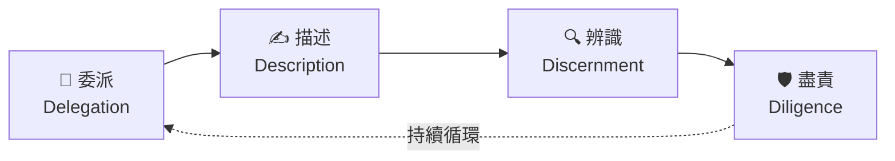
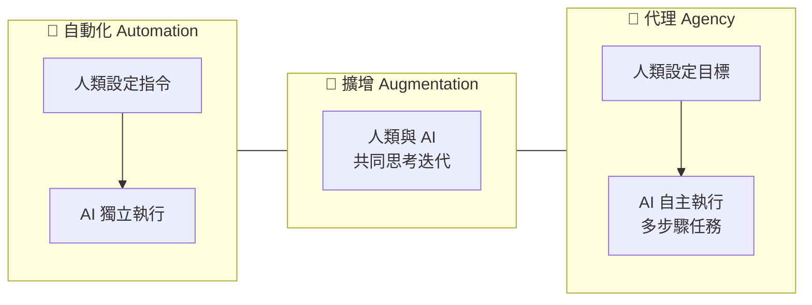

# 📓 第 02 課：4D 框架詳解

<Badge type="tip" text="NotebookLM 生成" /> <Badge type="info" text="影片摘要 + 簡報 + 測驗" />

> 以下內容由 Google NotebookLM 根據課程影片「The 4D Framework」自動生成，作為延伸濃縮學習素材。
> 📖 回到主課程：[AI 素養：框架與基礎](/ai-fluency/framework-foundations)

## 📋 課程概覽

### 第 02 課：AI 素養框架

正式介紹核心架構：4Ds（委派、描述、辨識、盡責）與三種人機互動模式（自動化、擴增、代理）。這是整門課程的概念地圖，後續每一課都在擴展這張地圖。

詳細說明：4Ds 與互動模式如何搭配

4Ds 是你的**能力工具箱**，三種模式是你選擇的**協作情境**，兩者組合形成完整的 AI 素養框架。  
在「自動化」模式下（AI 獨立執行任務），委派和辨識最關鍵——你需要判斷任務是否適合委派，並在事後審核結果；  
在「擴增」模式下（人機共同思考），描述和辨識最常用——你不斷精煉提示，評估每次的輸出；  
在「代理」模式下（AI 自主完成多步驟任務），盡責和委派的策略設計尤為重要——因為錯誤的後果可能已造成影響再才被發現。  
掌握框架後，你就能根據任務性質選擇最合適的協作方式。

## 📝 重點筆記

### 🧩 什麼是 4D 框架？

4D 框架是 AI 素養的**四大核心能力**，每個 D 代表一種與 AI 協作時必備的行動：

| 能力 | 英文 | 定義 |
|------|------|------|
| **委派** | Delegation | 設定目標，決定是否、何時、以何種方式與 AI 合作 |
| **描述** | Description | 精準描述目標，引導 AI 產出有用的行為與輸出 |
| **辨識** | Discernment | 準確評估 AI 輸出和行為的有用程度 |
| **盡責** | Diligence | 對我們使用 AI 的方式以及 AI 的輸出負起責任 |

  

    

      
🏛️

      
有效 Effective

    

    

      
⏱️

      
高效 Efficient

    

    

      
⚖️

      
倫理 Ethical

    

    

      
🛡️

      
安全 Safe

    

  

::: tip 4Ds 與 EEES 的關係
課程的副標題是「有效、高效、合乎倫理且安全地（Effectively, Efficiently, Ethically, and Safely）」——這四個形容詞是**實踐 4Ds 之後所達成的結果**，而不是 4Ds 本身。熟練地委派、描述、辨識與盡責，就能讓你的 AI 使用達到有效、高效、倫理且安全的標準。
:::

### 🔄 三種人機互動模式

4Ds 框架不只適用於一種合作方式，而是橫跨三種人機互動模式：

| 模式 | 英文 | 說明 | 範例 |
|------|------|------|------|
| **自動化** | Automation | AI 根據人類指令執行特定任務 | 讓 AI 整理電子郵件分類 |
| **擴增** | Augmentation | 人類與 AI 作為思考夥伴共同協作 | 與 AI 腦力激盪、共同撰寫 |
| **代理** | Agency | 人類設定目標，AI 獨立執行未來的多步驟任務 | 讓 AI 代理管理行程排程 |

理解你在哪種模式下工作，有助於選擇最合適的 4Ds 應用方式。

## 🧩 暖身：4D 概念選擇題

確認你對四個 D 的核心定義有正確的理解。

### 練習 1-1

<Quiz
  question="「準確評估 AI 輸出和行為的有用程度」是哪個 D 的定義？"
  :options="quizOptions1"
  :answer="2"
  explanation="Discernment（辨識）的核心是批判性評估 AI 的輸出——不是懷疑一切，而是有根據地判斷哪些輸出可用、哪些需要修正。委派是決策層面，描述是輸入層面，盡責是責任層面。"
/>

### 練習 1-2

<Quiz
  question="你需要準備一份 20 頁的季度報告，決定哪些章節讓 AI 起草、哪些由自己撰寫。這個決策過程對應哪個 D？"
  :options="quizOptions2"
  :answer="1"
  explanation="Delegation（委派）就是「設定目標，決定是否、何時、以何種方式與 AI 合作」。決定哪些章節委派給 AI、哪些自己寫，正是委派決策。起草提示才是描述，評估輸出才是辨識，聲明 AI 參與才是盡責。"
/>

### 練習 1-3

<Quiz
  question="關於「盡責（Diligence）」，以下哪個說法最正確？"
  :options="quizOptions3"
  :answer="1"
  explanation="Diligence（盡責）不只是貼標籤，而是主動承擔責任的態度：確認輸出的準確性、對使用 AI 的方式保持透明、確保符合倫理與組織規範。無論輸出多專業，最終責任都由使用者承擔。"
/>

---

## 🎬 影片摘要

::: info 🎬 影片摘要：Mastering AI Collaboration（約 5.5 分鐘）

**影片主軸：從工具使用者到協作指揮家**

| 時間段 | 畫面核心訊息 |
|--------|------------|
| 開場 | 標題「掌握 AI 協作」揭示本課核心目標 |
| 困境對比 | 困惑的個人（盯著電腦、頭上問號）vs 指揮家（指揮眾多想法與齒輪） |
| 第 1D：委派 | 你的戰略計畫——決定人類與 AI 各負責什麼 |
| 第 2D：描述 | 掌握對話——從單向指令進化為雙向迴圈 |
| 協作循環 | 描述 → 辨識 → 精煉（持續迭代的無限循環） |
| 第 3D：辨識 | 深思熟慮地評估 AI 產出，區分有用與無用 |
| 第 4D：盡責 | 以盾牌呈現四大責任支柱：公平、準確、安全、透明 |
| 結語 | 樹根深根比喻：基礎框架讓你在 AI 快速演進中持續受益 |

**課程核心主張：**
> 「真正的 AI 掌握，需要超越基礎提示詞，建立一套與工具無關的持久方法論。」

**描述—辨識—精煉循環（影片動畫重點）：**

步驟1 **描述**：清楚表達你的需求
步驟2 **辨識**：評估 AI 的輸出
步驟3 **精煉**：調整你的請求

這個循環在每次 AI 互動中反覆進行，不斷優化結果。
:::

## 📊 簡報概覽

::: tip 📊 簡報：AI 流暢度藍圖（由 NotebookLM 生成）
以下為 NotebookLM 根據「The 4D Framework」課程自動生成的簡報重點，以中文重製呈現：
:::

  <h4>🎯 掌握 AI 流暢度的藍圖</h4>
  
真正的 AI 流暢度需要超越基礎提示詞，建立一套<strong>與工具無關的持久方法論</strong>。特定應用程式和技術界面的淘汰速度極快，但基礎框架能確保你的協作能力隨技術進步無縫擴展。

  <h4>🔄 三種互動模式 × 流暢操作者</h4>
  

    

      <strong>輸入端</strong> 
      自動化（AI 執行任務） 
      擴增（人機共同思考） 
      代理（AI 自主多步驟）
    

    

      <strong>輸出端</strong> 
      有效（Effective） 
      高效（Efficient） 
      倫理（Ethical） 
      安全（Safe）
    

  

  
<small>流暢的操作者能持續將複雜技術轉化為可靠、負責、高品質的成果。</small>

  <h4>📋 四項核心能力總覽</h4>
  

    
<strong>委派</strong> <small>規劃人機分工</small>

    
<strong>描述</strong> <small>精準溝通需求</small>

    
<strong>辨識</strong> <small>評估 AI 產出</small>

    
<strong>盡責</strong> <small>負責任地使用</small>

  

  
<small>四項能力相互關聯，決定你如何規劃、執行、評估，並為 AI 協作承擔責任。</small>

  <h4>1️⃣ 委派：建立協作的戰略邊界</h4>
  
委派要求你理解整體目標，並根據能力深思熟慮地分配工作。

  

    

      <strong>AI 理想任務</strong> 
      審閱長篇文件與原始數據 
      進行廣泛影響的初步討論
    

    

      <strong>人類必要職責</strong> 
      執行發現的批判性分析 
      定義最終策略結論
    

  

  <h4>2️⃣ 描述：從基礎指令到富含背景的對話</h4>
  
有效描述需要清楚表達你的需求，為雙方協作成功奠定基礎。

  <table>
    <tr><td><strong>目標</strong></td><td>說明你想達成什麼</td></tr>
    <tr><td><strong>背景</strong></td><td>提供任務的場景脈絡</td></tr>
    <tr><td><strong>受眾</strong></td><td>說明輸出對象是誰</td></tr>
    <tr><td><strong>格式</strong></td><td>指定期望的呈現方式</td></tr>
    <tr><td><strong>語調</strong></td><td>設定互動的風格（如：導師、顧問）</td></tr>
  </table>

  <h4>3️⃣ 辨識：應用人類判斷，從噪音中分辨價值</h4>
  
辨識要求你根據自己的專業標準，深思熟慮地評估生成的素材。

  

    
✅ 呈現的事實是否完全準確？

    
✅ 內部推理是否合乎邏輯？

    
✅ 建議是否符合品牌價值？

    
✅ 此素材是否真正推動專案進展？

  

  <h4>4️⃣ 盡責：負責任 AI 使用的基礎承諾</h4>
  
盡責意味著對你的工作承擔全部所有權，並完全願意為最終產品背書。

  

    

      <strong>⚖️ 公平性</strong> 確保無偏見，控制歧視風險
    

    

      <strong>🔍 準確性</strong> 系統性驗證事實的正確性
    

    

      <strong>🔒 安全性</strong> 保護敏感個人與企業數據
    

    

      <strong>📢 透明度</strong> 明確揭露 AI 的參與程度
    

  

  <h4>🔁 整合生態系統：非線性清單，而是協作迴圈</h4>
  
委派和盡責建立了你專案的<strong>宏觀邊界</strong>（安全、策略性）；在這些邊界內，描述和辨識形成<strong>快速微迴圈</strong>（描述需求 → 評估輸出 → 精煉請求）。

## 🧪 延伸測驗

::: info 📌 關於這份測驗
以下 10 道題目由 **Google NotebookLM** 根據「The 4D Framework」課程影片自動生成，深度考驗 4D 各能力的精確定義、應用情境與協作循環機制。
:::

### 測驗 2-1

<Quiz
  question="根據 4D 框架，下列何者最能準確描述「委派」(Delegation) 的核心概念？"
  :options="nlmQ11Options"
  :answer="1"
  hint="思考這項能力與「願景」以及「策略性選擇」之間的關係。"
  explanation="委派的核心在於理解任務目標與 AI 的能力邊界，進而有目的地劃分人類與 AI 的職責。"
/>

### 測驗 2-2

<Quiz
  question="在「描述」(Description) 的能力中，為什麼與 AI 進行「富含背景資訊的對話」比「撰寫簡單提示詞」更為重要？"
  :options="nlmQ12Options"
  :answer="2"
  hint="回想文中提到的公司價值觀、目標受眾及特定教學模式的例子。"
  explanation="有效的描述涉及闡明需求、願景及運作背景，從而為雙方的成功協作奠定基礎。"
/>

### 測驗 2-3

<Quiz
  question="關於「辨識」(Discernment) 能力，下列哪一項描述反映了其在 AI 協作中的關鍵作用？"
  :options="nlmQ13Options"
  :answer="0"
  hint="思考當 AI 給出行銷策略建議時，人類專家應該扮演什麼樣的角色。"
  explanation="辨識要求使用者運用自身判斷力來篩選有用資訊，並識別何時需要修正或捨棄 AI 的產出。"
/>

### 測驗 2-4

<Quiz
  question="在 4D 框架中，「盡責」(Diligence) 的實踐最能體現在下列哪種行為中？"
  :options="nlmQ14Options"
  :answer="1"
  hint="考慮在招聘流程中使用 AI 時，如何確保過程既安全又符合倫理規範。"
  explanation="盡責涉及負責任的互動，包括控制偏差、保護敏感數據以及願意承擔作品的最終責任。"
/>

### 測驗 2-5

<Quiz
  question="大多數 AI 互動涉及「描述」(Description) 與「辨識」(Discernment) 之間的循環。關於此循環的運作，下列敘述何者正確？"
  :options="nlmQ15Options"
  :answer="1"
  hint="想想你在使用 AI 時，如果第一次結果不理想，你會採取什麼行動。"
  explanation="透過評估 AI 的初步產出並重新定義需求，使用者能在這種微循環中不斷優化結果。"
/>

### 測驗 2-6

<Quiz
  question="為什麼 4D 框架被視為一種能對抗技術過時 (future-proof) 的核心能力？"
  :options="nlmQ16Options"
  :answer="2"
  hint="回顧 AI 素養 (AI Fluency) 的定義，重點在於技能的本質。"
  explanation="4D 框架側重於知識、見解與價值觀，這些原則不論 AI 工具如何更迭都能適用。"
/>

### 測驗 2-7

<Quiz
  question="在研究專案的案例中，建議將「分析長篇文件」交給 AI，但將「最終結論」保留給自己。這主要體現了什麼？"
  :options="nlmQ17Options"
  :answer="1"
  hint="關鍵在於「分工」以及「誰負責處理什麼樣的工作」。"
  explanation="這展示了委派的本質：理解 AI 的強項（處理大數據）並保留人類核心價值（批判分析與結論）。"
/>

### 測驗 2-8

<Quiz
  question="在「描述」(Description) 階段中提到的「互動語調與風格」(Tone and style of interaction)，其目的是什麼？"
  :options="nlmQ18Options"
  :answer="2"
  hint="回想導師 (tutor) 的例子，使用者如何要求 AI 引導解決問題。"
  explanation="透過定義語調，可以更精確地引導 AI 以適合該場景的角色進行工作，例如以導師（tutor）的方式引導學習者逐步理解，而非直接給出答案。"
/>

### 測驗 2-9

<Quiz
  question="在評估 AI 的行銷建議時，若發現建議不符合品牌價值，這屬於 4D 框架中的哪一環？"
  :options="nlmQ19Options"
  :answer="2"
  hint="這涉及對 AI 給出的「答案」進行批判性思考與價值觀比對。"
  explanation="辨識涉及判斷 AI 的建議是否與使用者的專業知識、品牌價值觀及受眾目標一致。"
/>

### 測驗 2-10

<Quiz
  question="關於 AI 素養 (AI Fluency) 的定義，下列哪四項指標是 4D 框架旨在幫助我們達成的目標？"
  :options="nlmQ20Options"
  :answer="1"
  hint="思考課程開頭提到的那四個以「e」和「s」開頭的英文單字含義。"
  explanation="AI 素養的核心在於發展實踐技能，以達成有效 (effectively)、高效 (efficiently)、倫理 (ethically) 且安全 (safely) 的協作。"
/>

---

::: tip 🎯 下一步
理論看完了嗎？前往 [4D 互動練習](/ai-fluency/4d-practice) 動手操練四個核心能力。
:::

---

*本頁測驗由 Google NotebookLM 根據 [The AI Fluency Framework](https://aifluencyframework.org/) 課程影片自動生成（Rick Dakan & Joseph Feller，與 Anthropic 合作開發）。原課程素材以 CC BY-NC-SA 4.0 授權發佈。*
