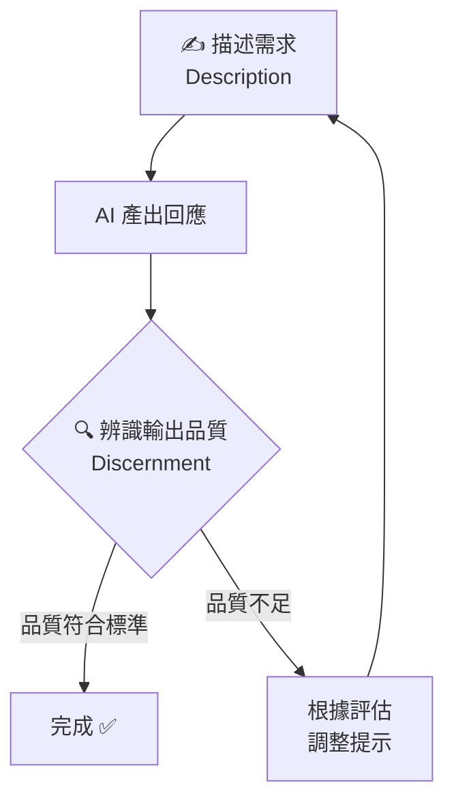

# 📓 第 09 課：描述—辨識循環

<Badge type="tip" text="NotebookLM 生成" /> <Badge type="info" text="影片摘要 + 簡報 + 測驗" />

> 以下內容由 Google NotebookLM 根據課程影片自動生成，作為延伸濃縮學習素材。  
> 📖 回到主課程：[AI 素養：框架與基礎](/ai-fluency/framework-foundations)

## 📋 課程概覽

### 第 09 課：實踐工作場景 2：分析與決策

探討如何運用 AI 進行數據分析、洞察提取與決策支持，提升工作的質與量。

---
## 🎬 影片摘要

::: info 🎬 NotebookLM 影片摘要
由 Google NotebookLM 根據課程影片自動生成的繁體中文動態摘要。
:::

<NlmVideo
  src="/videos/ai-fluency/nlm09-summary.mp4"
  poster="/images/ai-fluency/nlm09-video-poster.png"
  zh-vtt="/videos/ai-fluency/nlm09-summary.zh-Hant.vtt"
  en-vtt="/videos/ai-fluency/nlm09-summary.en.vtt"
  bi-vtt="/videos/ai-fluency/nlm09-summary.bilingual.vtt"
  default-mode="zh"
/>

### 📝 影片重點整理
本課程涵蓋的核心主題與議題概要。

## 📝 重點筆記

### 🔁 描述—辨識循環

「描述—辨識循環」是課程的核心互動模型：

這個循環提醒我們：**好的 AI 使用不是一次性的完美提示，而是持續迭代的協作過程。**

---
## 📊 簡報概覽

<SlideViewer :slides="nlm09Slides" />
---
## 🧪 延伸測驗

::: tip 🧪 互動學習
透過以下測驗檢測你對課程內容的理解程度。
:::

<Quiz :options="nlmQ81Options" />

<Quiz :options="nlmQ82Options" />

<Quiz :options="nlmQ83Options" />

<Quiz :options="nlmQ84Options" />

<Quiz :options="nlmQ85Options" />

<Quiz :options="nlmQ86Options" />

<Quiz :options="nlmQ87Options" />

<Quiz :options="nlmQ88Options" />

<Quiz :options="nlmQ89Options" />

<Quiz :options="nlmQ90Options" />
