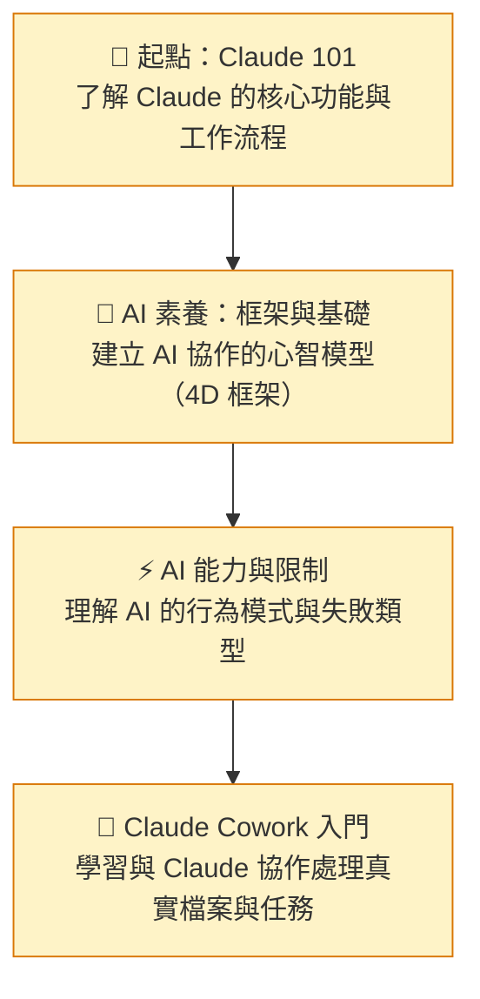
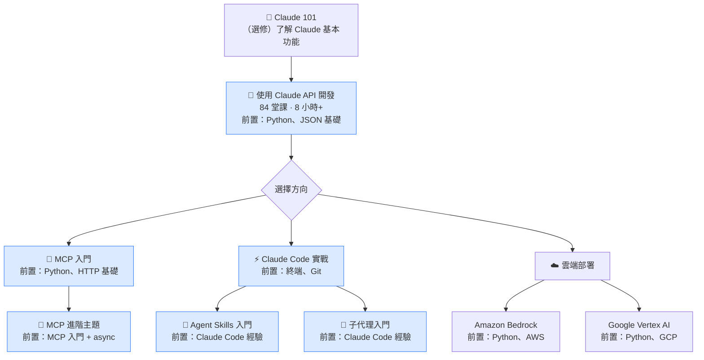
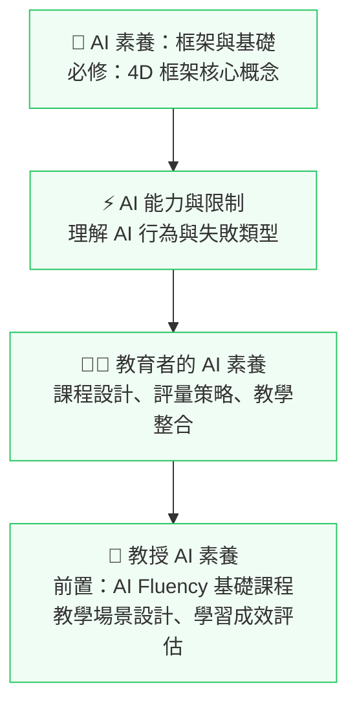
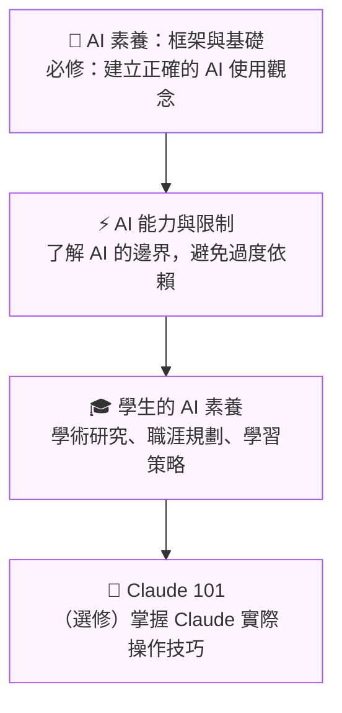

# 🗺️ 學習路線圖

依照你的目標和背景，選擇最適合的學習路線。每條路線都標註了課程順序與前置條件的關係。

## 🌱 路線一：初學者 / 一般使用者

**目標：** 掌握 AI 基礎知識，能在日常工作中有效使用 Claude

**預計時間：** 3–5 小時 | **難度：** ⭐ 初學者

---

## 💻 路線二：開發者

**目標：** 將 Claude 整合進應用程式，掌握 API、MCP 和代理架構

**預計時間：** 15–30 小時 | **難度：** ⭐⭐–⭐⭐⭐ 中-高級

---

## 👩‍🏫 路線三：教育者

**目標：** 將 AI 素養融入教學實踐與機構策略

**預計時間：** 4–6 小時 | **難度：** ⭐–⭐⭐ 初-中級

---

## 🎓 路線四：學生

**目標：** 利用 AI 提升學習效率、職涯規劃與學術成就

**預計時間：** 3–4 小時 | **難度：** ⭐ 初學者

---

## 📋 課程前置條件速查表

| 課程 | 必要前置條件 | 建議前置條件 |
|------|------------|------------|
| AI 素養：框架與基礎 | 無 | — |
| AI 能力與限制 | 無 | — |
| 教育者的 AI 素養 | 無 | AI 素養基礎 |
| 學生的 AI 素養 | 無 | AI 素養基礎 |
| 教授 AI 素養 | AI Fluency 基礎課程 | — |
| 非營利組織的 AI 素養 | 無 | AI Fluency 基礎 |
| Claude 101 | 無 | — |
| Claude Code 101 | 基本命令列操作 | — |
| Claude Cowork 入門 | 無 | — |
| 使用 Claude API 開發 | Python、JSON 基礎 | — |
| MCP 入門 | Python、JSON 和 HTTP 基礎 | — |
| MCP 進階主題 | MCP 入門課程、async 程式設計 | — |
| Claude Code 實戰 | 終端操作、Git 基礎 | — |
| Agent Skills 入門 | Claude Code 基本使用經驗 | — |
| 子代理入門 | Claude Code 基本使用經驗 | — |
| Claude × Amazon Bedrock | Python、AWS 基礎 | — |
| Claude × Google Vertex AI | Python、GCP 基礎 | — |
