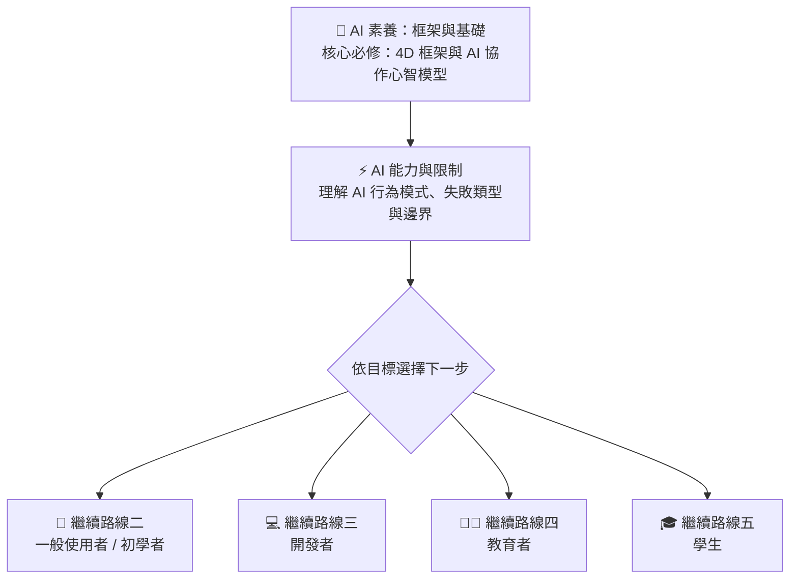
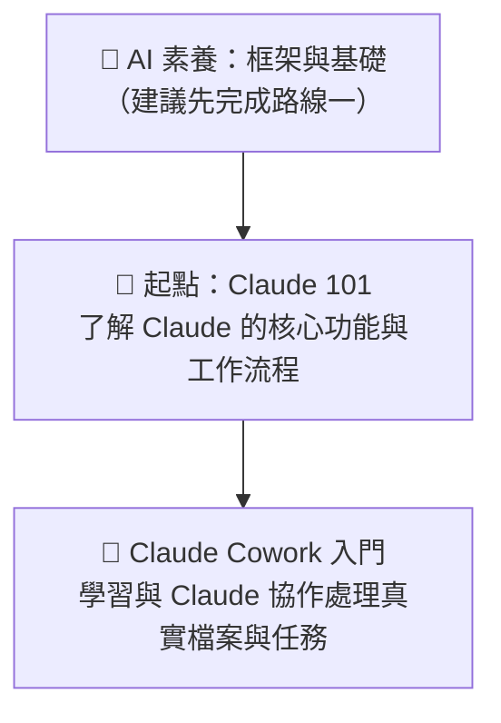
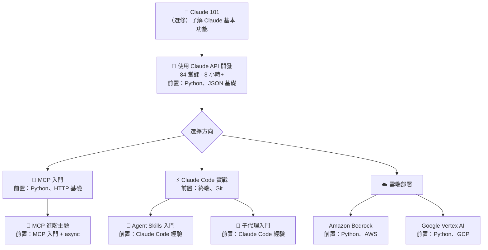
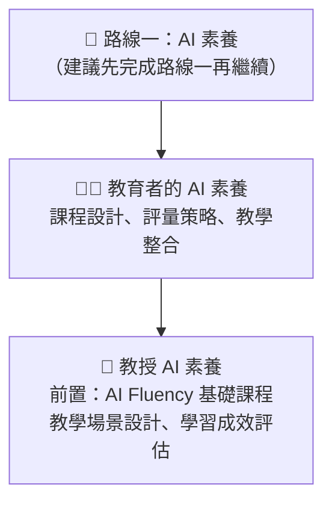
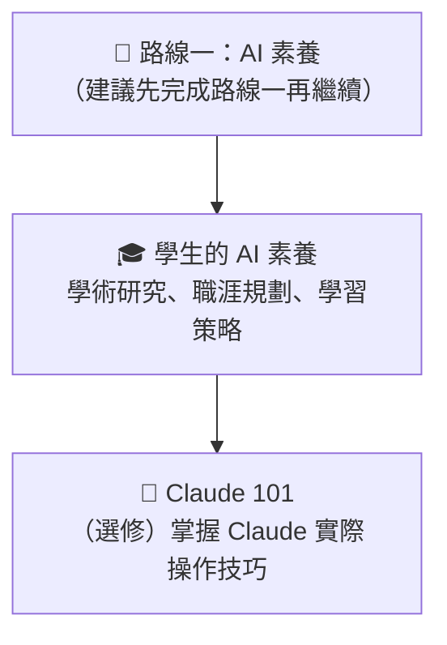

# 🗺️ 學習路線圖

依照你的目標和背景，選擇最適合的學習路線。每條路線都標註了課程順序與前置條件的關係。

## 📋 官方推薦學習路徑

  

    

      

        非工程師路徑
        
上班族・創作者・學生

      

      <ol class="path-courses">
        <li>
          

            
Claude 101

            
入門必修，了解核心功能

          

        </li>
        <li>
          

            
AI Fluency：基礎概覽

            
建立 AI 協作思維

          

        </li>
        <li>
          

            
Claude Cowork 入門

            
實際以應用場景延伸學習

          

        </li>
      </ol>
      
✓ 從「會用」升級到「懂用」

    

    

      

        開發者路徑
        
後端工程師・AI 開發者

      

      <ol class="path-courses">
        <li>
          

            
Claude Code 實戰

            
整合環境工具，提升開發效率

          

        </li>
        <li>
          

            
Agent Skills 入門

            
建立可重複使用工具鏈

          

        </li>
        <li>
          

            
使用 Claude API 開發

            
完整 API 整合知識

          

        </li>
        <li>
          

            
MCP 入門

            
擴展外部協議與工具

          

        </li>
      </ol>
      
✓ 具備完整 AI 開發能力

    

  

::: tip 🔍 圖表操作提示
點擊下方任一流程圖可放大檢視；放大後可 🖱️ 滾輪縮放、拖曳移動，按 ESC 關閉。
:::

## 🧠 路線一：AI 素養（所有人必讀）

::: warning ⚠️ 建議從這裡開始
無論你的背景或目標為何，**AI 素養是所有路線的共同基礎**。建立正確的 AI 觀念與心智模型，能讓你在後續任何路線中事半功倍。
:::

**目標：** 建立對 AI 的正確認知與協作心態，理解 AI 的能力邊界

**預計時間：** 1.5–2 小時 | **難度：** ⭐ 無前置條件

---

## 🌱 路線二：初學者 / 一般使用者

**目標：** 掌握 AI 基礎知識，能在日常工作中有效使用 Claude

**預計時間：** 3–5 小時 | **難度：** ⭐ 初學者

---

## 💻 路線三：開發者

**目標：** 將 Claude 整合進應用程式，掌握 API、MCP 和代理架構

**預計時間：** 15–30 小時 | **難度：** ⭐⭐–⭐⭐⭐ 中-高級

---

## 👩‍🏫 路線四：教育者

**目標：** 將 AI 素養融入教學實踐與機構策略

**預計時間：** 4–6 小時 | **難度：** ⭐–⭐⭐ 初-中級

---

## 🎓 路線五：學生

**目標：** 利用 AI 提升學習效率、職涯規劃與學術成就

**預計時間：** 3–4 小時 | **難度：** ⭐ 初學者

---

## 📋 課程前置條件速查表

| 課程 | 必要前置條件 | 建議前置條件 |
|------|------------|------------|
| AI 素養：框架與基礎 | 無 | — |
| AI 能力與限制 | 無 | — |
| 教育者的 AI 素養 | 無 | AI 素養基礎 |
| 學生的 AI 素養 | 無 | AI 素養基礎 |
| 教授 AI 素養 | AI Fluency 基礎課程 | — |
| 非營利組織的 AI 素養 | 無 | AI Fluency 基礎 |
| Claude 101 | 無 | — |
| Claude Code 101 | 基本命令列操作 | — |
| Claude Cowork 入門 | 無 | — |
| 使用 Claude API 開發 | Python、JSON 基礎 | — |
| MCP 入門 | Python、JSON 和 HTTP 基礎 | — |
| MCP 進階主題 | MCP 入門課程、async 程式設計 | — |
| Claude Code 實戰 | 終端操作、Git 基礎 | — |
| Agent Skills 入門 | Claude Code 基本使用經驗 | — |
| 子代理入門 | Claude Code 基本使用經驗 | — |
| Claude × Amazon Bedrock | Python、AWS 基礎 | — |
| Claude × Google Vertex AI | Python、GCP 基礎 | — |
